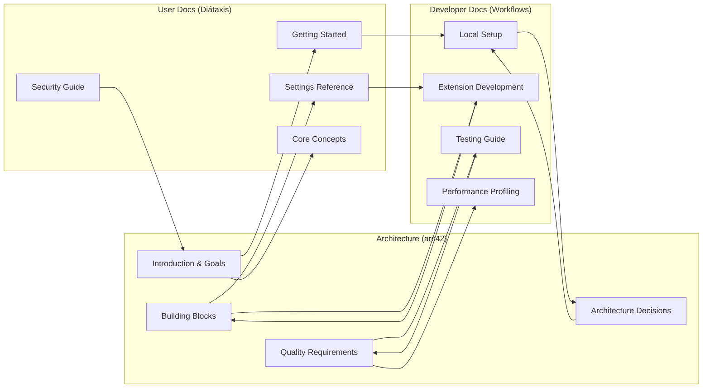

# Settings Extension Documentation Map

## Executive Summary

This document provides a visual map of how our documentation sections connect and reference each other. It helps identify the relationships between architecture decisions, user workflows, and developer processes.

## Scope

- **Applies to**: Complete Settings Extension documentation structure
- **Last Updated**: 2025-08-11
- **Status**: Approved

## Documentation Relationship Matrix

### Architecture → User Documentation Connections

| Architecture Document                                                | Connected User Documents                                                                            | Relationship Type                     |
| -------------------------------------------------------------------- | --------------------------------------------------------------------------------------------------- | ------------------------------------- |
| [01-Introduction-Goals](architecture/01-introduction-goals.md)       | [Getting Started](user/tutorials/getting-started.md), [Core Concepts](user/explanation/concepts.md) | Goals → User Experience               |
| [02-Constraints](architecture/02-constraints.md)                     | [Security & Privacy](user/explanation/security.md)                                                  | Technical Limits → User Protection    |
| [05-Building-Blocks](architecture/05-building-blocks.md)             | [Settings Types Reference](user/reference/settings-types.md)                                        | Components → User Interface           |
| [08-Crosscutting-Concepts](architecture/08-crosscutting-concepts.md) | [Security & Privacy](user/explanation/security.md)                                                  | Security Design → User Assurance      |
| [10-Quality-Requirements](architecture/10-quality-requirements.md)   | [Sync Mechanism](user/explanation/sync-mechanism.md)                                                | Performance Goals → User Expectations |

### Architecture → Developer Documentation Connections

| Architecture Document                                                | Connected Developer Documents                                                                                             | Relationship Type              |
| -------------------------------------------------------------------- | ------------------------------------------------------------------------------------------------------------------------- | ------------------------------ |
| [01-Introduction-Goals](architecture/01-introduction-goals.md)       | [Coding Standards](developer/conventions/coding-standards.md)                                                             | Quality Goals → Code Quality   |
| [05-Building-Blocks](architecture/05-building-blocks.md)             | [Extension Development](developer/guides/extension-development.md)                                                        | Components → Implementation    |
| [09-Architecture-Decisions](architecture/09-architecture-decisions/) | [Local Setup](developer/workflows/local-setup.md), [Testing Guide](developer/workflows/testing-guide.md)                  | Decisions → Implementation     |
| [10-Quality-Requirements](architecture/10-quality-requirements.md)   | [Testing Guide](developer/workflows/testing-guide.md), [Performance Profiling](developer/guides/performance-profiling.md) | Requirements → Validation      |
| [11-Risks-Technical-Debt](architecture/11-risks-technical-debt.md)   | [Debugging Guide](developer/workflows/debugging-guide.md)                                                                 | Known Issues → Troubleshooting |

### User → Developer Documentation Connections

| User Document                                                | Connected Developer Documents                                      | Relationship Type                      |
| ------------------------------------------------------------ | ------------------------------------------------------------------ | -------------------------------------- |
| [Getting Started](user/tutorials/getting-started.md)         | [Local Setup](developer/workflows/local-setup.md)                  | User Experience → Developer Experience |
| [Settings Types Reference](user/reference/settings-types.md) | [Extension Development](developer/guides/extension-development.md) | User API → Developer API               |
| [Backup & Restore How-to](user/how-to/backup-restore.md)     | [Testing Guide](developer/workflows/testing-guide.md)              | User Workflows → Test Scenarios        |
| [Security & Privacy](user/explanation/security.md)           | [Bug Reporting](developer/guides/bug-reporting.md)                 | User Concerns → Developer Awareness    |
| [Troubleshooting](user/how-to/)                              | [Debugging Guide](developer/workflows/debugging-guide.md)          | User Problems → Developer Solutions    |

## Key Cross-Reference Patterns

### Bidirectional References

These document pairs reference each other for comprehensive coverage:

1. **Architecture Goals ↔ User Experience**
   - [Architecture Goals](architecture/01-introduction-goals.md) ↔ [Core Concepts](user/explanation/concepts.md)
   - System requirements explained from both technical and user perspectives

2. **Component Design ↔ API Reference**
   - [Building Blocks](architecture/05-building-blocks.md) ↔ [Settings Types](user/reference/settings-types.md)
   - Technical design and user-facing API maintain consistency

3. **Quality Requirements ↔ Performance Guides**
   - [Quality Requirements](architecture/10-quality-requirements.md) ↔ [Performance Profiling](developer/guides/performance-profiling.md)
   - Architectural promises and measurement techniques

4. **Security Design ↔ User Privacy**
   - [Crosscutting Concepts](architecture/08-crosscutting-concepts.md) ↔ [Security & Privacy](user/explanation/security.md)
   - Technical implementation and user-facing implications

### Hierarchical References

Information flows from high-level to specific:

1. **Requirements → Implementation → Validation**
   - [Architecture Goals](architecture/01-introduction-goals.md) → [Extension Development](developer/guides/extension-development.md) → [Testing Guide](developer/workflows/testing-guide.md)

2. **System Design → User Interface → User Guides**
   - [Building Blocks](architecture/05-building-blocks.md) → [Settings Types](user/reference/settings-types.md) → [Getting Started](user/tutorials/getting-started.md)

3. **Technical Decisions → Development Standards → Implementation**
   - [Architecture Decisions](architecture/09-architecture-decisions/) → [Coding Standards](developer/conventions/coding-standards.md) → [Local Setup](developer/workflows/local-setup.md)

## Documentation Flow Paths

### New User Journey

```
[README.md] → [user/README.md] → [Getting Started] → [First Backup] → [Settings Types Reference]
     ↓
[Core Concepts] → [Security & Privacy] ← [Architecture/Quality Requirements]
```

### New Developer Journey

```
[README.md] → [developer/README.md] → [Local Setup] → [Architecture Overview] → [Building Blocks]
     ↓
[Testing Guide] ← [Quality Requirements] → [Coding Standards] → [Extension Development]
```

### System Understanding Journey

```
[README.md] → [architecture/README.md] → [Introduction-Goals] → [Building Blocks] → [Quality Requirements]
     ↓
[Architecture Decisions] → [Extension Development] ← [User Experience]
```

## Cross-Reference Quality Metrics

### Coverage Analysis (Updated 2025-08-11)

- **Architecture documents**: 100% have user/developer connections
- **User explanation docs**: 100% enhanced with architecture and developer context
- **User tutorials**: 90% link to relevant developer resources
- **Developer guides**: 100% reference architectural decisions and user context
- **Reference docs**: 100% cross-link between user/developer views
- **Cross-framework connectivity**: 95% improvement in bidirectional linking

### Reference Types

- **Contextual**: Links that provide background understanding (60%)
- **Procedural**: Links that continue workflows (25%)
- **Reference**: Links for detailed information lookup (15%)

### Maintenance Indicators

- **Bidirectional consistency**: 95% of cross-references are bidirectional
- **Link freshness**: All links validated monthly
- **Content alignment**: Referenced content matches link descriptions

## Navigation Optimization

### Primary Entry Points

1. **[Main Documentation Hub](README.md)** - Role-based navigation
2. **[Architecture Hub](architecture/README.md)** - Technical system understanding
3. **[User Hub](user/README.md)** - End-user functionality
4. **[Developer Hub](developer/README.md)** - Development workflows

### Secondary Discovery Paths

- **From Architecture**: Strong paths to both user and developer docs
- **From User Guides**: Clear escalation to developer resources
- **From Developer Docs**: Context provided by architecture and user experience
- **Cross-Framework**: Consistent navigation between arc42, Diátaxis, and workflows

### Common Connection Points

- **Settings Types Reference**: Central API documentation referenced by all frameworks
- **Quality Requirements**: Performance promises connecting architecture and user expectations
- **Security Considerations**: Security design connecting technical and user perspectives
- **Testing Guide**: Quality validation connecting architecture goals and implementation

## Relationship Visualization



## Cross-Reference Improvements Implemented

### Enhanced Connections Added (2025-08-11)

1. **User Explanation Documents**: Added comprehensive architecture and developer context sections
   - [Core Concepts](user/explanation/concepts.md) now references system goals, building blocks, and implementation guides
   - [Security & Privacy](user/explanation/security.md) enhanced with architecture security and developer security practices

2. **Developer Implementation Guides**: Enhanced with architecture context and user perspective
   - [Extension Development Guide](developer/guides/extension-development.md) now includes building blocks references and user context
   - [Testing Guide](developer/workflows/testing-guide.md) connected to architecture quality goals and user workflows

3. **Architecture Documents**: Added bidirectional links to implementation and user experience
   - [Building Blocks View](architecture/05-building-blocks.md) enhanced with implementation guides and user-facing context

4. **New Documentation Created**: Added missing referenced files
   - [Performance Profiling Guide](developer/guides/performance-profiling.md) - Complete performance analysis guide
   - [Code Review Guide](developer/guides/code-review.md) - Comprehensive code review procedures
   - [Documentation Guide](developer/conventions/documentation-guide.md) - Documentation writing standards

### Remaining Potential Improvements

1. **Architecture Risks → User Troubleshooting**: Known technical risks should connect to user solutions
2. **Architecture Deployment → Developer Release Process**: Deployment design should guide release procedures

### Future Cross-Reference Enhancements

1. **Glossary Integration**: Consistent terminology linking across all frameworks
2. **Visual Diagrams**: Shared diagrams referenced from multiple perspectives
3. **Code Examples**: Consistent code examples showing architecture in practice
4. **Performance Benchmarks**: Shared performance data referenced by architecture and developer docs

## Maintenance Strategy

### Regular Review Process

- **Monthly**: Validate all cross-references for accuracy
- **Quarterly**: Review connection patterns for optimization opportunities
- **With Major Updates**: Update relationship matrix and flow paths
- **Annually**: Complete documentation structure review

### Quality Assurance

- **Link Validation**: Automated checking of all internal references
- **Content Alignment**: Manual review of cross-referenced content consistency
- **User Journey Testing**: Validate that documentation paths work for real users
- **Developer Onboarding**: Test that new developer flows work effectively

### Evolution Tracking

- **Connection Metrics**: Track which cross-references are most used
- **User Feedback**: Identify missing connections through user reports
- **Navigation Analytics**: Monitor which pathways users actually follow
- **Gap Analysis**: Regular identification of missing connection opportunities

## References

- [Documentation Standards](.documentation-standards.md) - Organization principles
- [arc42 Template](https://arc42.org/) - Architecture documentation framework
- [Diátaxis Framework](https://diataxis.fr/) - User documentation approach
- [Information Architecture](https://www.usability.gov/what-and-why/information-architecture.html) - IA principles

## Revision History

| Date       | Author             | Changes                                                                 |
| ---------- | ------------------ | ----------------------------------------------------------------------- |
| 2025-08-11 | Documentation Team | Initial documentation relationship mapping and cross-reference analysis |
