# Settings Extension Documentation

## Executive Summary

Welcome to the comprehensive documentation hub for the Settings Extension project. This documentation is designed to serve multiple audiences - from end users learning to use the extension, to developers integrating with our APIs, to contributors working on the codebase itself.

Our documentation follows a structured approach combining three complementary frameworks to provide complete coverage while avoiding duplication:

- **[Architecture Documentation](architecture/)** - Technical design using arc42 framework
- **[User Documentation](user/)** - End-user guides using Diátaxis framework  
- **[Developer Documentation](developer/)** - Practical workflow guides for contributors

## Quick Navigation by Role

### 🎯 I want to use the Settings Extension
**Start here:** [User Documentation](user/)

- **New to the extension?** → [Getting Started Guide](user/tutorials/getting-started.md)
- **Need to do something specific?** → [How-to Guides](user/how-to/)
- **Looking up details?** → [Reference Documentation](user/reference/)
- **Want to understand how it works?** → [Concept Explanations](user/explanation/)

### 💻 I want to integrate with the Settings Extension
**Start here:** [Developer Documentation](developer/)

- **Setting up development?** → [Local Setup Guide](developer/workflows/local-setup.md)
- **Need API information?** → [Settings Types Reference](user/reference/settings-types.md)
- **Want to contribute?** → [Contributing Guidelines](CONTRIBUTING.md)
- **Troubleshooting issues?** → [Troubleshooting Guide](developer/guides/troubleshooting.md)

### 🏗️ I want to understand the system architecture
**Start here:** [Architecture Documentation](architecture/)

- **New team member?** → [Introduction & Goals](architecture/01-introduction-goals.md)
- **Understanding the design?** → [Building Blocks View](architecture/05-building-blocks.md)
- **Looking for technical decisions?** → [Architecture Decisions](architecture/09-architecture-decisions/)
- **Quality requirements?** → [Quality Requirements](architecture/10-quality-requirements.md)

## Documentation Structure Overview

```
docs/
├── README.md                          # This file - Documentation hub
├── .documentation-standards.md        # Documentation standards and organization
├── CONTRIBUTING.md                     # Contribution guidelines
│
├── architecture/                      # 🏗️ System Design (arc42 framework)
│   ├── 01-introduction-goals.md       # Requirements and quality goals
│   ├── 02-constraints.md              # Technical constraints
│   ├── 03-context.md                  # System scope and interfaces  
│   ├── 04-solution-strategy.md        # Key architectural decisions
│   ├── 05-building-blocks.md          # Component structure
│   ├── 06-runtime-view.md             # Dynamic behavior
│   ├── 07-deployment.md               # Infrastructure view
│   ├── 08-crosscutting-concepts.md    # System-wide concepts
│   ├── 09-architecture-decisions/     # Decision records (ADRs)
│   ├── 10-quality-requirements.md     # Quality scenarios
│   └── 11-risks-technical-debt.md     # Risk assessment
│
├── user/                              # 👤 End-User Guides (Diátaxis framework)
│   ├── tutorials/                     # Learning-oriented (step-by-step)
│   ├── how-to/                        # Task-oriented (problem-solving)
│   ├── reference/                     # Information-oriented (lookup)
│   └── explanation/                   # Understanding-oriented (concepts)
│
└── developer/                         # 💻 Developer Workflows
    ├── workflows/                     # Development processes
    ├── guides/                        # Specific development scenarios
    └── conventions/                   # Team standards and practices
```

## Documentation Map

This visual map shows the relationships between different documentation sections:

```mermaid
graph TD
    A[👤 User Needs Extension] --> B[User Documentation]
    B --> B1[Tutorials - Learn]
    B --> B2[How-to - Tasks]
    B --> B3[Reference - Lookup]
    B --> B4[Explanation - Understand]
    
    C[💻 Developer Wants to Contribute] --> D[Developer Documentation]
    D --> D1[Workflows - Setup & Testing]
    D --> D2[Guides - Specific Scenarios]
    D --> D3[Conventions - Standards]
    
    E[🏗️ Architect Needs System Design] --> F[Architecture Documentation]
    F --> F1[Requirements & Goals]
    F --> F2[Solution Strategy]
    F --> F3[Building Blocks]
    F --> F4[Quality & Risks]
    
    B3 -.->|API Details| D2
    D1 -.->|Setup References| F2
    F1 -.->|User Goals| B4
    D3 -.->|Quality Standards| F4
    B2 -.->|Troubleshooting| D2
    F3 -.->|Implementation| D1
```



## Common Documentation Pathways

### For First-Time Users
1. [Getting Started Tutorial](user/tutorials/getting-started.md) - Installation and basic use
2. [Your First Backup](user/tutorials/first-backup.md) - Essential functionality
3. [Settings Types Reference](user/reference/settings-types.md) - Understanding what's configurable
4. [Security & Privacy](user/explanation/security.md) - Understanding data protection

### For Extension Developers  
1. [Local Setup Guide](developer/workflows/local-setup.md) - Development environment
2. [Architecture Overview](architecture/01-introduction-goals.md) - System understanding
3. [Building Blocks View](architecture/05-building-blocks.md) - Component structure
4. [Coding Standards](developer/conventions/coding-standards.md) - Code quality
5. [Testing Guide](developer/workflows/testing-guide.md) - Testing procedures

### For API Integration
1. [Settings Types Reference](user/reference/settings-types.md) - Available settings
2. [Configuration Reference](user/reference/configuration.md) - Configuration options
3. [Extension Development Guide](developer/guides/extension-development.md) - Integration patterns
4. [Cross-Browser Testing](developer/guides/cross-browser-testing.md) - Compatibility testing

### For System Architecture
1. [Introduction & Goals](architecture/01-introduction-goals.md) - Project overview
2. [Solution Strategy](architecture/04-solution-strategy.md) - High-level approach
3. [Building Blocks View](architecture/05-building-blocks.md) - System structure  
4. [Architecture Decisions](architecture/09-architecture-decisions/) - Key technical choices
5. [Quality Requirements](architecture/10-quality-requirements.md) - Performance and reliability

## Cross-Reference Quick Links

### Architecture ↔ User Documentation
- [System Goals](architecture/01-introduction-goals.md) explain [User Concepts](user/explanation/concepts.md)
- [Quality Requirements](architecture/10-quality-requirements.md) define [Performance Expectations](user/explanation/sync-mechanism.md)
- [Security Architecture](architecture/08-crosscutting-concepts.md) underpins [Security Guide](user/explanation/security.md)

### Architecture ↔ Developer Documentation  
- [Building Blocks](architecture/05-building-blocks.md) guide [Extension Development](developer/guides/extension-development.md)
- [Architecture Decisions](architecture/09-architecture-decisions/) inform [Coding Standards](developer/conventions/coding-standards.md)
- [Deployment View](architecture/07-deployment.md) shapes [Release Process](developer/workflows/release-process.md)

### User ↔ Developer Documentation
- [User Troubleshooting](user/how-to/) connects to [Developer Troubleshooting](developer/guides/troubleshooting.md)
- [Settings Reference](user/reference/settings-types.md) supports [Extension Development](developer/guides/extension-development.md)
- [User Workflows](user/how-to/) inform [Testing Scenarios](developer/workflows/testing-guide.md)

## Frequently Accessed Documents

### Most Popular Starting Points
1. **[Getting Started](user/tutorials/getting-started.md)** - First-time user guide
2. **[Local Setup](developer/workflows/local-setup.md)** - Developer environment setup
3. **[Contributing Guidelines](CONTRIBUTING.md)** - How to contribute
4. **[Architecture Overview](architecture/01-introduction-goals.md)** - System understanding
5. **[Settings Reference](user/reference/settings-types.md)** - Complete settings list

### Essential Reference Documents
- **[Settings Types](user/reference/settings-types.md)** - All supported setting types
- **[Keyboard Shortcuts](user/reference/keyboard-shortcuts.md)** - Productivity shortcuts
- **[Configuration Options](user/reference/configuration.md)** - Complete configuration reference
- **[Architecture Decisions](architecture/09-architecture-decisions/)** - Technical decision records
- **[Coding Standards](developer/conventions/coding-standards.md)** - Code quality guidelines

### Key Process Documents
- **[Testing Guide](developer/workflows/testing-guide.md)** - Testing procedures and requirements
- **[Release Process](developer/workflows/release-process.md)** - How releases are made
- **[Git Workflow](developer/conventions/git-workflow.md)** - Git branching and commit standards
- **[Bug Reporting](developer/guides/bug-reporting.md)** - How to report issues effectively

## Getting Help

### Documentation Issues
- **Missing information?** → Create issue with label `documentation`
- **Unclear instructions?** → Open discussion for clarification
- **Found errors?** → Submit pull request with corrections
- **Need new guides?** → Request in issues with `enhancement` label

### Technical Support by Audience

**End Users:**
1. Check [User Documentation](user/)
2. Search [existing issues](https://github.com/settings-extension/settings-extension/issues)
3. Review [Troubleshooting How-to Guides](user/how-to/)
4. Create new issue with `user-support` label

**Developers:**
1. Review [Developer Documentation](developer/)
2. Check [Architecture Documentation](architecture/) for system design
3. Search [discussions](https://github.com/settings-extension/settings-extension/discussions)
4. Ask in GitHub Discussions with `developer` category

**Contributors:**
1. Read [Contributing Guidelines](CONTRIBUTING.md)
2. Follow [Local Setup Guide](developer/workflows/local-setup.md)  
3. Review [Coding Standards](developer/conventions/coding-standards.md)
4. Join community discussions for guidance

## Documentation Standards

This documentation follows our [Documentation Standards](.documentation-standards.md) which define:

- **Organization principles** for the three-framework approach
- **Writing guidelines** for consistency and clarity  
- **Cross-referencing standards** for connecting related content
- **Maintenance procedures** for keeping docs current
- **Quality requirements** for documentation contributions

Key standards include:
- **Executive summaries** for all major documents
- **Scope and status** metadata for tracking
- **Revision history** for change tracking
- **Consistent cross-referencing** using relative links
- **Regular review cycles** for accuracy

## Contributing to Documentation

Documentation contributions are welcome and valued! Here's how to contribute:

### Quick Contributions
- **Fix typos or errors** - Submit PR directly
- **Add missing links** - Improve cross-referencing
- **Update screenshots** - Keep visuals current
- **Clarify instructions** - Make guides clearer

### Larger Contributions
1. **Read [Documentation Standards](.documentation-standards.md)**
2. **Follow [Contributing Guidelines](CONTRIBUTING.md)**
3. **Check existing content** to avoid duplication
4. **Use appropriate framework** (arc42, Diátaxis, or Developer Guides)
5. **Add proper cross-references** to related content
6. **Test all instructions** and code examples

### Documentation Review Process
- **Technical accuracy** verified by subject matter experts
- **Writing clarity** checked for target audience  
- **Link validation** to ensure all references work
- **Framework compliance** to maintain organization standards

## Maintenance and Updates

### Regular Review Schedule
- **Architecture docs** - Quarterly review for technical accuracy
- **User guides** - Updated with each release
- **Developer workflows** - Monthly review based on team feedback
- **Cross-references** - Validated during major updates

### Freshness Indicators
Each document includes:
- **Last Updated** date in scope section
- **Status** (Draft/Review/Approved) 
- **Revision History** table
- **Applies To** scope definition

### Automated Maintenance
Where possible, we automate:
- **Link validation** to catch broken references
- **Markdown linting** for consistent formatting
- **Cross-reference checking** to maintain connections
- **Screenshot automation** for UI documentation

## Project Context

### Browser Extension Framework
The Settings Extension is a comprehensive Manifest V3 browser extension framework providing:
- Cross-browser settings management (Chrome, Edge, Firefox)
- Rich data type support (Boolean, text, numbers, JSON)
- User-friendly interfaces (popup and options pages)
- Developer API for programmatic access
- Import/export functionality for settings backup

### Quality Goals
- **Performance**: Settings operations < 100ms, UI load < 500ms
- **Reliability**: 99.9% data persistence success rate
- **Compatibility**: 100% feature parity across browsers
- **Maintainability**: >80% test coverage, clear documentation

### Success Metrics
- Documentation helps users accomplish tasks efficiently
- Developers can onboard and contribute within 1 day
- Support burden remains manageable through self-service docs
- Architecture decisions are clearly documented and justified

## External Resources

### Browser Extension Development
- [Chrome Extensions Developer Guide](https://developer.chrome.com/docs/extensions/)
- [Firefox WebExtensions Documentation](https://developer.mozilla.org/en-US/docs/Mozilla/Add-ons/WebExtensions)
- [Manifest V3 Migration Guide](https://developer.chrome.com/docs/extensions/mv3/intro/)

### Documentation Frameworks
- [arc42 Architecture Template](https://arc42.org/)
- [Diátaxis Documentation System](https://diataxis.fr/)
- [Technical Writing Guidelines](https://developers.google.com/tech-writing)

### Development Tools  
- [Node.js Documentation](https://nodejs.org/en/docs/)
- [Jest Testing Framework](https://jestjs.io/docs/getting-started)
- [ESLint Configuration](https://eslint.org/docs/user-guide/)

## Revision History

| Date | Author | Changes |
|------|--------|---------|
| 2025-08-11 | Documentation Team | Initial documentation hub created with comprehensive navigation and cross-references |

---

**Need help navigating?** Start with your role above, or browse the [Documentation Standards](.documentation-standards.md) to understand our organization approach.