# Runtime View

## Executive Summary

This document describes the dynamic behavior of the Settings Extension, illustrating how components interact during runtime to fulfill various use cases. It provides sequence diagrams and runtime scenarios that show the system's behavior from different perspectives.

## Scope

- **Applies to**: Dynamic system behavior and component interactions
- **Last Updated**: 2025-08-11
- **Status**: Approved

## Runtime Scenarios

### 6.1 Core Runtime Scenarios

This section covers the most important runtime scenarios that demonstrate the key architectural patterns and component interactions.

#### Scenario Overview

| Scenario                     | Frequency                | Complexity | Performance Requirement |
| ---------------------------- | ------------------------ | ---------- | ----------------------- |
| **Extension Initialization** | Once per browser session | Medium     | < 500ms                 |
| **Settings Retrieval**       | Very High                | Low        | < 100ms                 |
| **Settings Update**          | High                     | Medium     | < 100ms                 |
| **UI Rendering**             | Medium                   | Medium     | < 500ms                 |
| **Import/Export**            | Low                      | High       | < 2000ms                |
| **Error Recovery**           | Low                      | High       | < 1000ms                |

## Scenario 1: Extension Initialization

### 6.2 Extension Startup Sequence

This scenario shows how the Settings Extension initializes when the browser starts or the extension is installed/enabled.

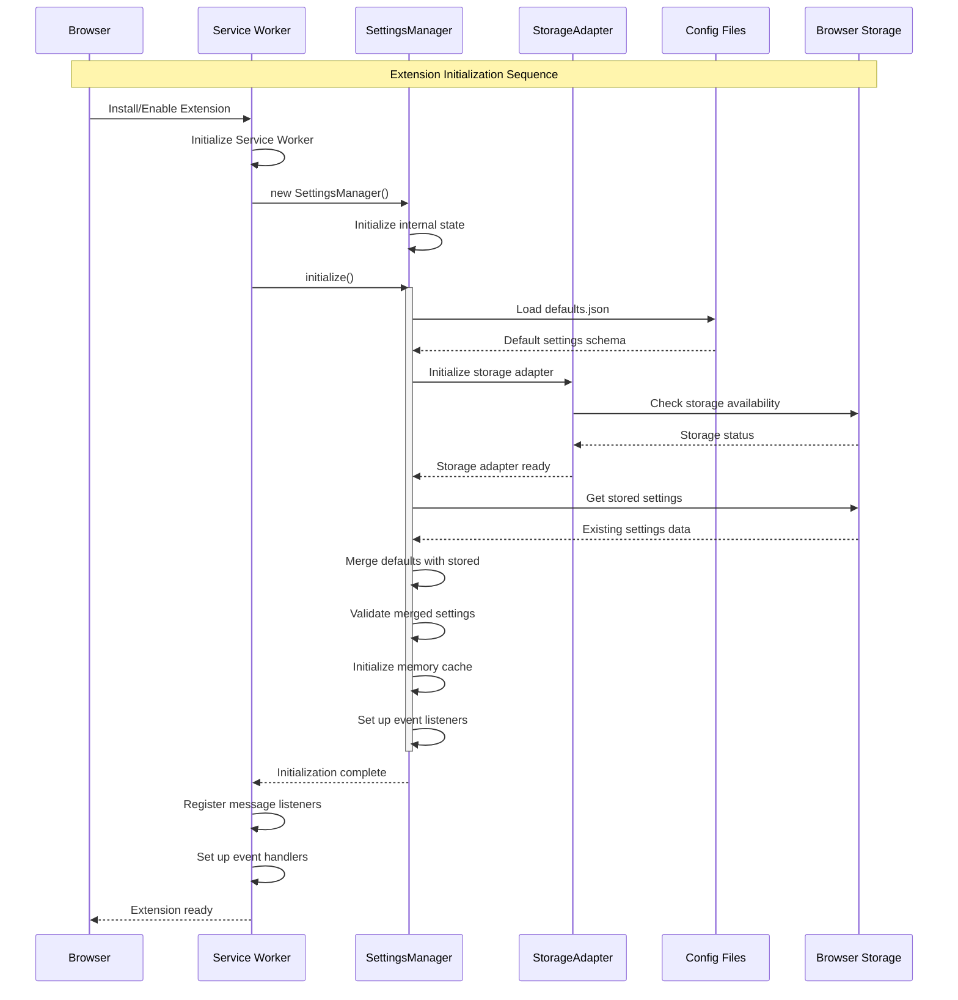

**Key Points:**

- Service worker initializes immediately when browser starts
- Settings manager loads defaults before checking stored settings
- Merged configuration is validated before system becomes ready
- Memory cache is populated during initialization for performance
- Error handling ensures graceful degradation if initialization fails

### 6.3 Initialization Error Handling

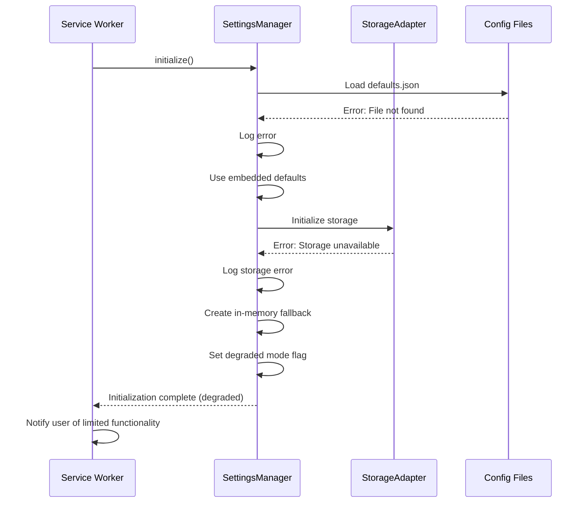

## Scenario 2: Settings Retrieval from Content Script

### 6.4 Content Script Settings Access

This scenario demonstrates how content scripts access settings through the API.

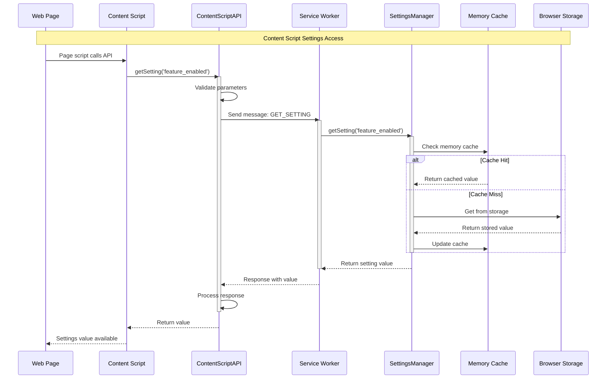

**Performance Optimizations:**

- Memory cache reduces storage API calls
- Batch operations minimize message passing overhead
- Async operations prevent UI blocking
- Error responses include fallback values

### 6.5 Bulk Settings Retrieval

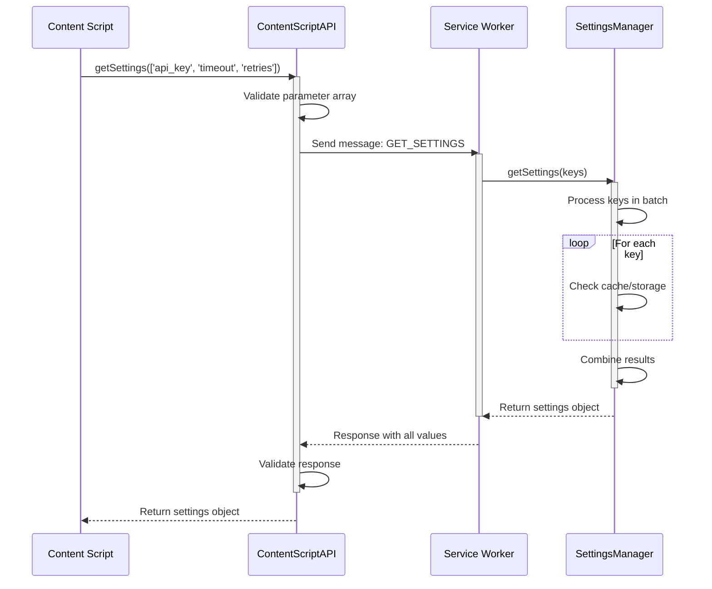

## Scenario 3: Settings Update from UI

### 6.6 Popup UI Settings Update

This scenario shows how settings are updated through the popup interface.

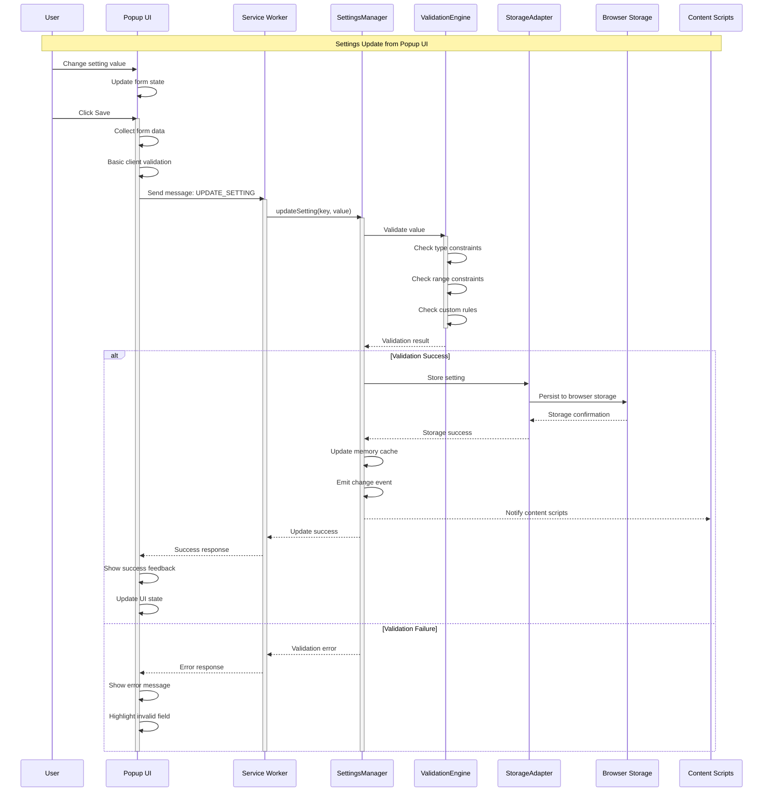

**Key Features:**

- Client-side validation for immediate feedback
- Server-side validation for data integrity
- Atomic updates prevent partial state
- Event propagation notifies all components
- Clear error feedback guides user correction

### 6.7 Bulk Settings Update

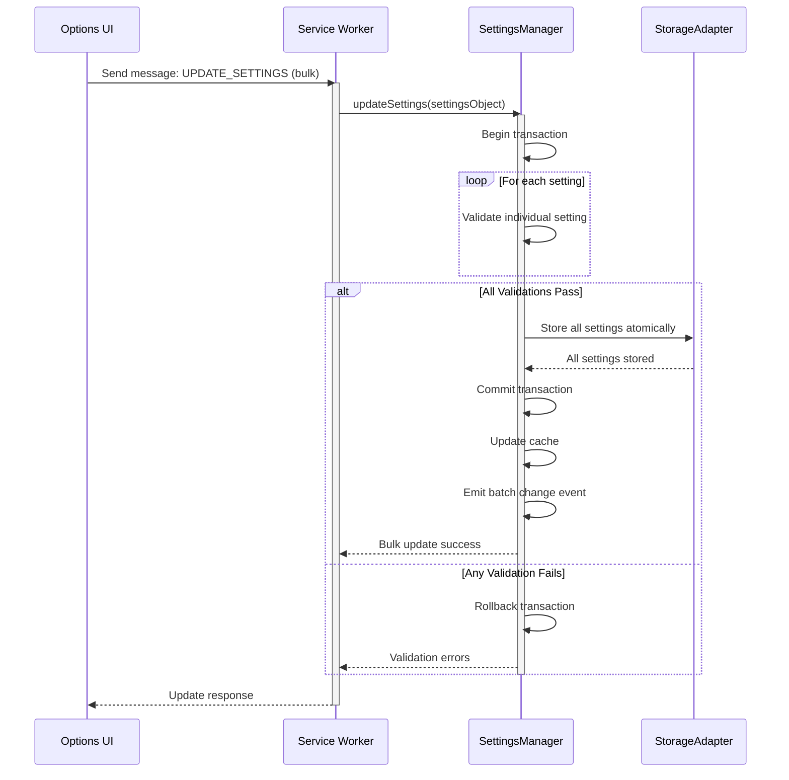

## Scenario 4: Import/Export Operations

### 6.8 Settings Export Process

This scenario demonstrates how users can export their settings configuration.

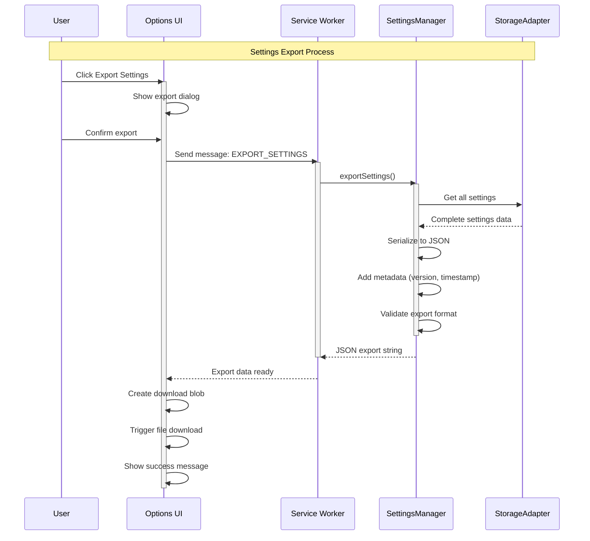

### 6.9 Settings Import Process

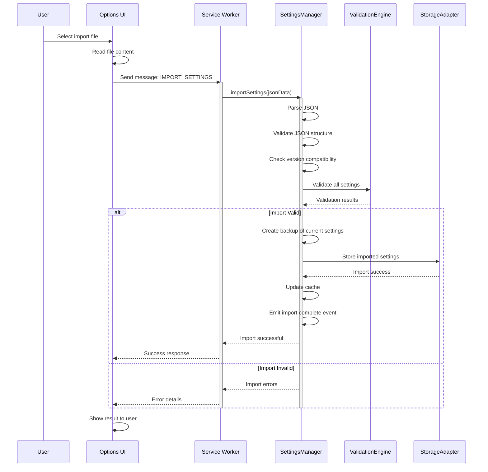

## Scenario 5: Error Recovery

### 6.10 Storage Error Recovery

This scenario shows how the system handles storage failures and recovers gracefully.

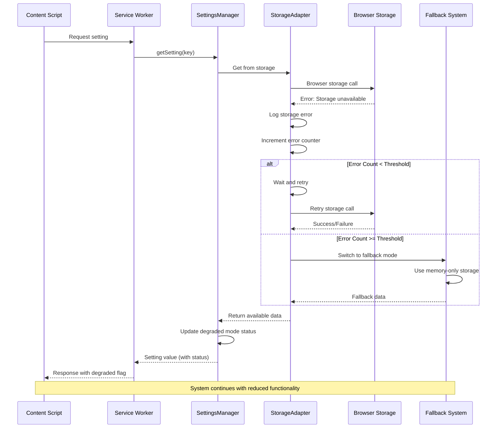

### 6.11 Service Worker Recovery

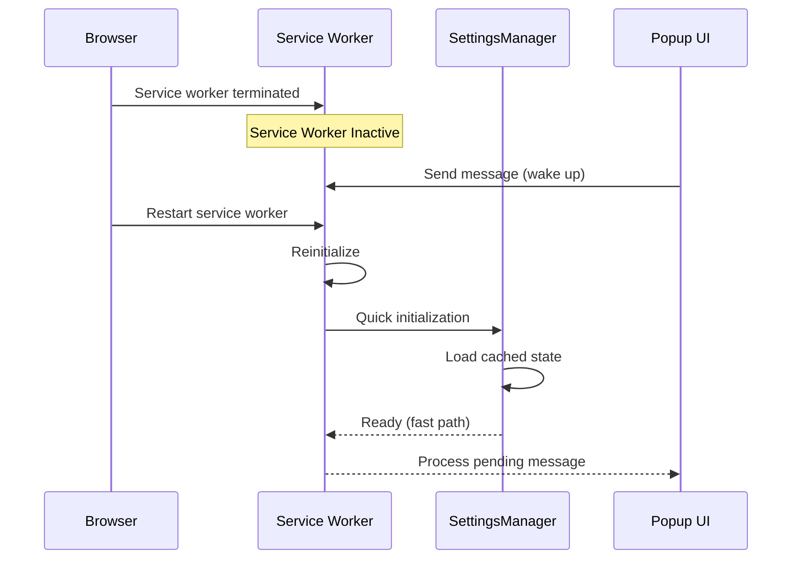

## Performance Characteristics

### 6.12 Runtime Performance Metrics

| Operation                    | Target Time | Typical Time | Max Acceptable |
| ---------------------------- | ----------- | ------------ | -------------- |
| **Extension Initialization** | < 300ms     | ~200ms       | 500ms          |
| **Single Setting Get**       | < 50ms      | ~20ms        | 100ms          |
| **Single Setting Set**       | < 100ms     | ~50ms        | 200ms          |
| **Bulk Settings Get**        | < 100ms     | ~60ms        | 200ms          |
| **Bulk Settings Set**        | < 200ms     | ~150ms       | 500ms          |
| **UI Rendering**             | < 300ms     | ~200ms       | 500ms          |
| **Export Operation**         | < 1000ms    | ~500ms       | 2000ms         |
| **Import Operation**         | < 1500ms    | ~800ms       | 3000ms         |

### 6.13 Memory Usage Patterns

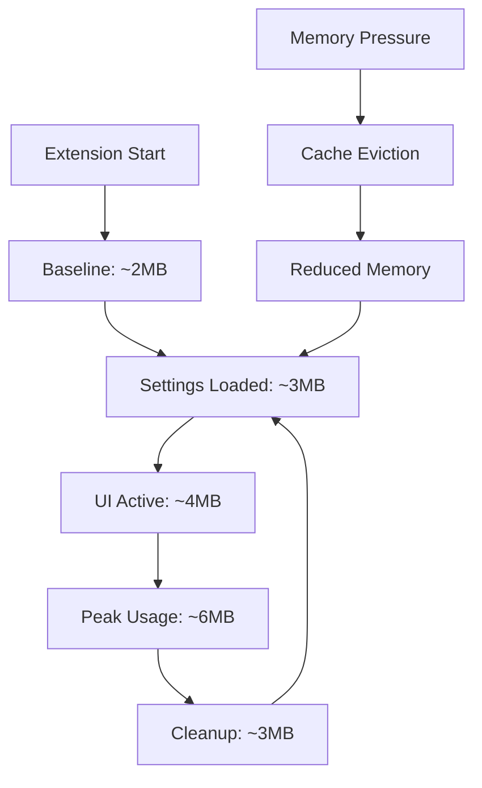

### 6.14 Concurrency Patterns

The Settings Extension handles multiple concurrent operations through:

- **Message Queuing**: Service worker queues messages during initialization
- **Atomic Operations**: Settings updates are atomic to prevent race conditions
- **Lock-Free Reads**: Read operations don't block each other
- **Event-Driven Updates**: Change notifications are asynchronous

## Error Handling Patterns

### 6.15 Error Classification

| Error Type                | Handling Strategy       | User Impact | Recovery Time |
| ------------------------- | ----------------------- | ----------- | ------------- |
| **Validation Errors**     | Immediate user feedback | High        | Immediate     |
| **Storage Errors**        | Retry + fallback        | Medium      | < 1 second    |
| **Network Errors**        | Graceful degradation    | Low         | Varies        |
| **Browser API Errors**    | Feature detection       | Low         | Immediate     |
| **Initialization Errors** | Safe defaults           | Medium      | < 5 seconds   |

### 6.16 Error Recovery Flow

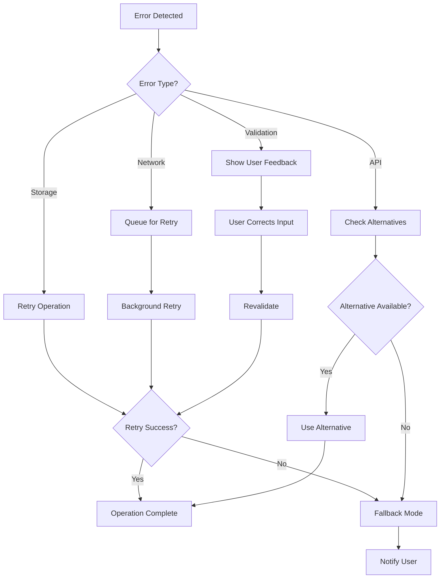

## References

- [Browser Extension Message Passing](https://developer.chrome.com/docs/extensions/mv3/messaging/)
- [Service Worker Lifecycle](https://developer.chrome.com/docs/extensions/mv3/service-workers/)
- [Storage API Performance](https://developer.mozilla.org/en-US/docs/Mozilla/Add-ons/WebExtensions/API/storage)

## Revision History

| Date       | Author            | Changes                                         |
| ---------- | ----------------- | ----------------------------------------------- |
| 2025-08-11 | Architecture Team | Initial runtime scenarios and sequence diagrams |
