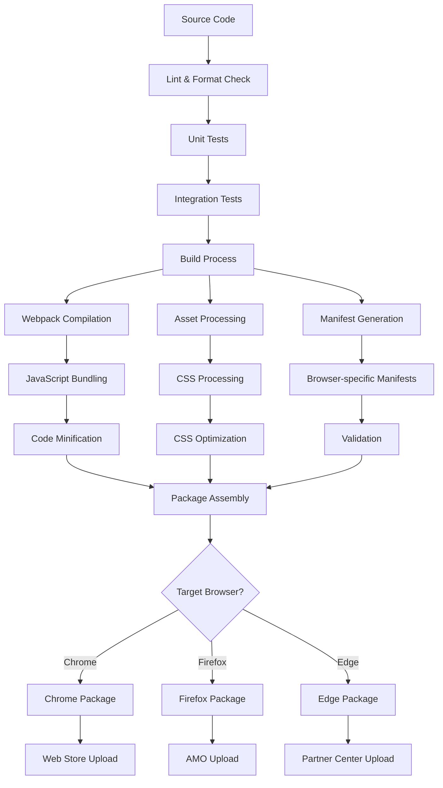
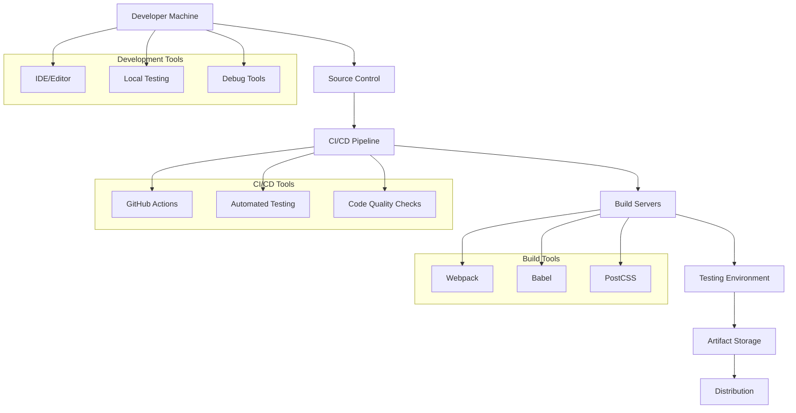
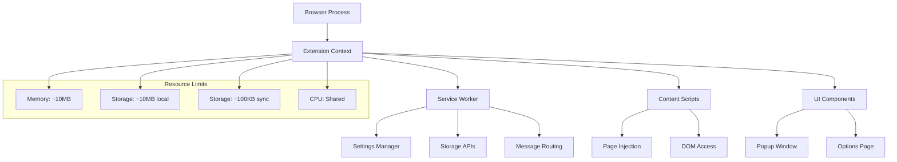
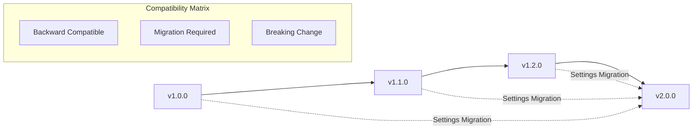

# Deployment View

## Executive Summary

This document describes the deployment architecture of the Settings Extension, including the technical infrastructure, distribution mechanisms, installation processes, and operational considerations. It covers how the extension is packaged, distributed, and deployed across different browser environments.

## Scope

- **Applies to**: Deployment infrastructure, distribution, and operational aspects
- **Last Updated**: 2025-08-11
- **Status**: Approved

## Deployment Overview

### 7.1 Deployment Context

The Settings Extension follows a client-side deployment model where the extension is distributed through official browser extension stores and loaded directly into user browsers. There is no server-side infrastructure required for core functionality.

```
┌─────────────────────────────────────────────────────────────────────────────┐
│                        Deployment Architecture                               │
│                                                                             │
│  ┌─────────────────┐    ┌─────────────────┐    ┌─────────────────────────┐  │
│  │   Development   │    │     Build &     │    │      Distribution       │  │
│  │   Environment   │    │   Packaging     │    │       Channels          │  │
│  │                 │    │                 │    │                         │  │
│  │ • Source Code   │───▶│ • Webpack Build │───▶│ • Chrome Web Store      │  │
│  │ • Local Testing │    │ • Asset Copy    │    │ • Firefox Add-ons       │  │
│  │ • Unit Tests    │    │ • Manifest Gen  │    │ • Direct Distribution   │  │
│  │ • Integration   │    │ • Validation    │    │ • Enterprise Deploy     │  │
│  └─────────────────┘    └─────────────────┘    └─────────────────────────┘  │
│                                 │                           │                │
│                                 ▼                           ▼                │
│  ┌─────────────────────────────────────────────────────────────────────────┐ │
│  │                        Target Environments                              │ │
│  │                                                                         │ │
│  │  ┌─────────────────┐  ┌─────────────────┐  ┌─────────────────────────┐ │ │
│  │  │     Chrome      │  │     Firefox     │  │      Edge Chromium      │ │ │
│  │  │   Environment   │  │   Environment   │  │      Environment        │ │ │
│  │  │                 │  │                 │  │                         │ │ │
│  │  │ • Manifest V3   │  │ • WebExtensions │  │ • Manifest V3           │ │ │
│  │  │ • Chrome APIs   │  │ • Firefox APIs  │  │ • Chrome APIs           │ │ │
│  │  │ • Local Storage │  │ • Local Storage │  │ • Local Storage         │ │ │
│  │  └─────────────────┘  └─────────────────┘  └─────────────────────────┘ │ │
│  └─────────────────────────────────────────────────────────────────────────┘ │
└─────────────────────────────────────────────────────────────────────────────┘
```

### 7.2 Deployment Characteristics

| Characteristic         | Details                           |
| ---------------------- | --------------------------------- |
| **Architecture Type**  | Client-side browser extension     |
| **Distribution Model** | Store-based + Direct distribution |
| **Update Mechanism**   | Automatic browser-managed updates |
| **Scalability**        | Horizontal (per-browser instance) |
| **Availability**       | Browser-dependent                 |
| **State Management**   | Local browser storage             |
| **Security Model**     | Browser sandbox + permissions     |

## Build and Packaging

### 7.3 Build Pipeline

The Settings Extension uses a multi-stage build pipeline that prepares the extension for different target environments.



### 7.4 Build Configuration

#### Development Build

```bash
npm run build:dev
```

- Source maps included
- Debug logging enabled
- Non-minified code
- Development manifest
- Local testing optimizations

#### Production Build

```bash
npm run build:prod
```

- Code minification
- Asset optimization
- Production manifest
- Debug logging removed
- Security headers added

#### Browser-Specific Builds

```bash
npm run build:chrome    # Chrome Web Store package
npm run build:firefox   # Firefox AMO package
npm run build:edge      # Edge Add-ons package
```

### 7.5 Package Structure

The built extension package contains the following structure:

```
settings-extension-package/
├── manifest.json              # Browser-specific manifest
├── background.js              # Service worker (minified)
├── content-script.js          # Content script (minified)
│
├── popup/                     # Popup UI files
│   ├── popup.html
│   ├── popup.js
│   └── popup.css
│
├── options/                   # Options page files
│   ├── options.html
│   ├── options.js
│   └── options.css
│
├── lib/                       # Core library files
│   ├── settings-manager.js    # Core business logic
│   ├── content-settings.js    # Content script API
│   ├── browser-compat.js      # Compatibility layer
│   └── validation.js          # Validation engine
│
├── config/                    # Configuration files
│   └── defaults.json          # Default settings
│
├── icons/                     # Extension icons
│   ├── icon16.png
│   ├── icon48.png
│   └── icon128.png
│
└── _metadata/                 # Package metadata
    ├── version.json
    ├── build-info.json
    └── checksums.json
```

## Distribution Channels

### 7.6 Official Store Distribution

#### Chrome Web Store

- **Target Audience**: Chrome browser users
- **Distribution URL**: `https://chrome.google.com/webstore`
- **Package Format**: `.zip` file
- **Review Process**: Automated + manual review
- **Update Mechanism**: Automatic browser updates
- **Rollout Strategy**: Staged rollout (1%, 10%, 50%, 100%)

**Chrome Web Store Metadata:**

```json
{
  "name": "Settings Extension",
  "short_name": "SettingsExt",
  "description": "Comprehensive settings management for browser extensions",
  "category": "Developer Tools",
  "privacy_practices": {
    "collects_data": false,
    "uses_encryption": true,
    "data_usage": "Local storage only"
  }
}
```

#### Firefox Add-ons (AMO)

- **Target Audience**: Firefox browser users
- **Distribution URL**: `https://addons.mozilla.org`
- **Package Format**: `.xpi` file
- **Review Process**: Automated security scan + manual review
- **Update Mechanism**: Automatic browser updates
- **Signing**: Mozilla code signing required

**Firefox AMO Metadata:**

```json
{
  "name": "Settings Extension",
  "summary": "Comprehensive settings management framework",
  "description": "Provides robust settings management capabilities...",
  "categories": ["developer-tools", "productivity"],
  "license": "MIT",
  "support_url": "https://github.com/settings-extension/issues"
}
```

#### Microsoft Edge Add-ons

- **Target Audience**: Edge browser users
- **Distribution URL**: `https://microsoftedge.microsoft.com/addons`
- **Package Format**: `.zip` file (Chrome-compatible)
- **Review Process**: Automated + manual review
- **Update Mechanism**: Automatic browser updates

### 7.7 Alternative Distribution Channels

#### Direct Distribution

- **Use Case**: Enterprise deployment, beta testing
- **Package Format**: Unpacked extension folder or `.zip`
- **Installation**: Manual "Load unpacked" or drag-and-drop
- **Updates**: Manual or custom update mechanism
- **Audience**: Developers, enterprise users, beta testers

#### Enterprise Distribution

- **Use Case**: Corporate environments
- **Method**: Group Policy deployment
- **Format**: Registry entries + extension files
- **Management**: Centralized IT administration
- **Updates**: Controlled by IT policy

#### Developer Distribution

- **Use Case**: Development and testing
- **Method**: Local file system
- **Installation**: Developer mode loading
- **Updates**: Manual rebuild and reload

## Infrastructure Requirements

### 7.8 Development Infrastructure



#### Development Environment Requirements

| Component   | Requirement             | Purpose                  |
| ----------- | ----------------------- | ------------------------ |
| **Node.js** | v16+                    | Build system and tooling |
| **npm**     | v8+                     | Package management       |
| **Git**     | v2.20+                  | Source control           |
| **Browser** | Chrome 88+, Firefox 78+ | Testing targets          |
| **Editor**  | VS Code (recommended)   | Development IDE          |

#### Build Server Requirements

| Resource    | Minimum | Recommended | Purpose           |
| ----------- | ------- | ----------- | ----------------- |
| **CPU**     | 2 cores | 4 cores     | Build compilation |
| **Memory**  | 4GB     | 8GB         | Build processes   |
| **Storage** | 20GB    | 50GB        | Build artifacts   |
| **Network** | 10Mbps  | 100Mbps     | Package downloads |

### 7.9 CI/CD Pipeline

#### GitHub Actions Workflow

```yaml
name: Build and Deploy Settings Extension

on:
  push:
    branches: [main, develop]
  pull_request:
    branches: [main]

jobs:
  test:
    runs-on: ubuntu-latest
    steps:
      - uses: actions/checkout@v3
      - uses: actions/setup-node@v3
        with:
          node-version: "18"
      - run: npm ci
      - run: npm run lint
      - run: npm test
      - run: npm run test:coverage

  build:
    needs: test
    runs-on: ubuntu-latest
    strategy:
      matrix:
        browser: [chrome, firefox, edge]
    steps:
      - uses: actions/checkout@v3
      - uses: actions/setup-node@v3
        with:
          node-version: "18"
      - run: npm ci
      - run: npm run build:${{ matrix.browser }}
      - uses: actions/upload-artifact@v3
        with:
          name: extension-${{ matrix.browser }}
          path: dist/

  deploy:
    needs: build
    runs-on: ubuntu-latest
    if: github.ref == 'refs/heads/main'
    steps:
      - name: Deploy to Chrome Web Store
        env:
          CHROME_CLIENT_ID: ${{ secrets.CHROME_CLIENT_ID }}
          CHROME_CLIENT_SECRET: ${{ secrets.CHROME_CLIENT_SECRET }}
          CHROME_REFRESH_TOKEN: ${{ secrets.CHROME_REFRESH_TOKEN }}
        run: |
          npm run deploy:chrome

      - name: Deploy to Firefox AMO
        env:
          AMO_JWT_ISSUER: ${{ secrets.AMO_JWT_ISSUER }}
          AMO_JWT_SECRET: ${{ secrets.AMO_JWT_SECRET }}
        run: |
          npm run deploy:firefox
```

## Runtime Environment

### 7.10 Browser Runtime Environment

The Settings Extension operates within the browser's extension runtime environment, which provides:

#### System Requirements

| Browser     | Minimum Version | Manifest Version | API Level |
| ----------- | --------------- | ---------------- | --------- |
| **Chrome**  | 88.0            | Manifest V3      | Full      |
| **Firefox** | 78.0            | WebExtensions    | Full      |
| **Edge**    | 88.0            | Manifest V3      | Full      |
| **Safari**  | Not Supported   | N/A              | N/A       |

#### Runtime Resources



### 7.11 Security Context

The extension operates within browser security constraints:

#### Permission Model

- **Minimal Permissions**: Only request necessary permissions
- **Storage Access**: Local and sync storage APIs
- **Active Tab**: Access to active tab when needed
- **No Host Permissions**: No broad web access required

#### Security Boundaries

```
┌─────────────────────────────────────────────┐
│              Browser Security               │
│                                             │
│  ┌─────────────────────────────────────────┐ │
│  │         Extension Sandbox               │ │
│  │                                         │ │
│  │  ┌─────────────┐  ┌─────────────────┐  │ │
│  │  │   Service   │  │   Content       │  │ │
│  │  │   Worker    │  │   Scripts       │  │ │
│  │  │             │  │                 │  │ │
│  │  │ • Storage   │  │ • Page Access   │  │ │
│  │  │ • Messages  │  │ • DOM API       │  │ │
│  │  │ • No DOM    │  │ • No Extension  │  │ │
│  │  │             │  │   APIs          │  │ │
│  │  └─────────────┘  └─────────────────┘  │ │
│  └─────────────────────────────────────────┘ │
│                                             │
│  ┌─────────────────────────────────────────┐ │
│  │            Web Pages                   │ │
│  │         (Isolated Context)             │ │
│  └─────────────────────────────────────────┘ │
└─────────────────────────────────────────────┘
```

## Operational Considerations

### 7.12 Monitoring and Logging

#### Client-Side Monitoring

- **Performance Metrics**: Operation timing, memory usage
- **Error Tracking**: Exception logging, error rates
- **Usage Analytics**: Feature usage (with user consent)
- **Health Checks**: Storage availability, API functionality

#### Logging Strategy

```javascript
// Structured logging with different levels
const Logger = {
  error: (message, context) => console.error(message, context),
  warn: (message, context) => console.warn(message, context),
  info: (message, context) => console.info(message, context),
  debug: (message, context) => {
    if (DEBUG_MODE) console.debug(message, context);
  },
};
```

### 7.13 Update and Rollback Strategy

#### Automatic Updates

- **Browser-Managed**: Browsers handle update distribution
- **Update Frequency**: Within 24-48 hours of store approval
- **Rollout Control**: Staged rollout through store controls
- **Emergency Updates**: Fast-track for critical security fixes

#### Rollback Procedures

1. **Store Rollback**: Revert to previous version in stores
2. **User Communication**: Clear messaging about issues
3. **Data Migration**: Backward compatibility for settings data
4. **Emergency Disable**: Remote disable capability through stores

#### Version Compatibility



### 7.14 Disaster Recovery

#### Data Recovery Scenarios

| Scenario                | Impact   | Recovery Method       | RTO          |
| ----------------------- | -------- | --------------------- | ------------ |
| **Settings Corruption** | High     | Restore from defaults | < 1 minute   |
| **Storage Failure**     | Medium   | Fallback to memory    | Immediate    |
| **Extension Crash**     | High     | Browser restart       | < 30 seconds |
| **Store Removal**       | Critical | Direct distribution   | < 1 day      |

#### Backup Strategies

- **User-Initiated**: Export/import functionality
- **Automatic Backup**: Browser sync storage
- **Recovery Tools**: Built-in reset and recovery options

## Performance and Scalability

### 7.15 Performance Targets

| Metric                  | Target        | Measurement Method        |
| ----------------------- | ------------- | ------------------------- |
| **Installation Time**   | < 10 seconds  | Store installation timing |
| **Initialization Time** | < 500ms       | Extension startup timing  |
| **Memory Usage**        | < 10MB        | Browser task manager      |
| **Storage Usage**       | < 5MB typical | Storage API monitoring    |
| **Update Time**         | < 30 seconds  | Browser update mechanism  |

### 7.16 Scalability Considerations

The extension scales horizontally across browser instances:

- **Per-Browser Isolation**: Each browser maintains separate state
- **Cross-Device Sync**: Browser's built-in sync mechanisms
- **No Central Server**: No bottlenecks or single points of failure
- **Resource Efficiency**: Minimal resource usage per instance

## References

- [Chrome Extension Deployment](https://developer.chrome.com/docs/webstore/publish/)
- [Firefox Add-on Distribution](https://extensionworkshop.com/documentation/publish/)
- [Edge Add-ons Deployment](https://docs.microsoft.com/en-us/microsoft-edge/extensions-chromium/publish/)
- [Extension Security Best Practices](https://developer.chrome.com/docs/extensions/mv3/security/)

## Revision History

| Date       | Author            | Changes                                                    |
| ---------- | ----------------- | ---------------------------------------------------------- |
| 2025-08-11 | Architecture Team | Initial deployment architecture and operational procedures |
