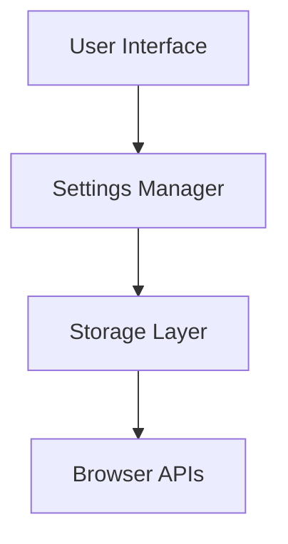

# Architecture Diagrams

## Executive Summary

This directory contains visual representations of the Settings Extension architecture using various diagramming approaches. These diagrams complement the written architecture documentation by providing visual clarity on system structure, component relationships, and operational flows.

## Scope

- **Applies to**: System architecture visualization
- **Last Updated**: 2025-08-11
- **Status**: Approved

## Diagram Types

### 1. C4 Model Diagrams

We use the C4 model for hierarchical architecture visualization:

- **Level 1: System Context** - How the extension fits in the browser ecosystem
- **Level 2: Container** - Major components and their relationships
- **Level 3: Component** - Detailed component breakdown
- **Level 4: Code** - Implementation details (as needed)

### 2. Sequence Diagrams

Dynamic behavior and interaction flows:

- Message passing between components
- User interaction workflows
- Error handling scenarios
- Lifecycle management

### 3. Deployment Diagrams

Extension deployment and runtime environment:

- Browser extension architecture
- File structure and organization
- Browser API interactions
- Cross-browser compatibility

## Available Diagrams

### System Overview

- **[system-context.md](system-context.md)** - C4 Level 1: Extension in browser ecosystem
- **[container-overview.md](container-overview.md)** - C4 Level 2: Major components and boundaries

### Component Architecture

- **[component-interactions.md](component-interactions.md)** - C4 Level 3: Detailed component view *(Draft - Placeholder)*
- **[settings-flow.md](settings-flow.md)** - Settings operation sequence diagrams *(Draft - Placeholder)*
- **[message-passing.md](message-passing.md)** - Inter-component communication flows *(Draft - Placeholder)*

### Runtime Views

- **[user-workflows.md](user-workflows.md)** - User interaction sequences *(Draft - Placeholder)*
- **[error-handling.md](error-handling.md)** - Error scenario handling *(Draft - Placeholder)*
- **[browser-compatibility.md](browser-compatibility.md)** - Cross-browser operation flows *(Draft - Placeholder)*

### Technical Details

- **[storage-architecture.md](storage-architecture.md)** - Storage system design *(Draft - Placeholder)*
- **[api-integration.md](api-integration.md)** - Browser API integration patterns *(Draft - Placeholder)*

## Diagram Standards

### Notation and Style

**C4 Model Colors:**

- System Context: Blue (#1168bd)
- Containers: Light Blue (#438dd5)
- Components: Medium Blue (#85bbf0)
- External Systems: Gray (#999999)

**Sequence Diagram Elements:**

- Actors: Human figures
- Systems: Rectangles
- Messages: Arrows with labels
- Activations: Vertical rectangles

### Diagram Format

All diagrams are provided in:

- **Markdown**: Text-based diagrams using Mermaid syntax
- **Source Format**: Editable format for updates
- **Export Format**: PNG/SVG for presentations (when needed)

### Update Process

1. **Source of Truth**: Markdown files with Mermaid diagrams
2. **Rendering**: GitHub renders Mermaid automatically
3. **Validation**: Diagrams reviewed with architecture changes
4. **Versioning**: Diagrams versioned with documentation

## Diagram Maintenance

### Consistency Requirements

- All diagrams must align with current implementation
- Component names must match code structure
- Relationships must reflect actual dependencies
- Flows must represent actual message passing

### Update Triggers

Diagrams should be updated when:

- New components are added or removed
- Component relationships change
- User workflows are modified
- API integrations change
- Architecture decisions impact system structure

### Review Process

1. **Architecture Changes**: Review diagrams during ADR process
2. **Implementation Changes**: Update diagrams with significant code changes
3. **Documentation Reviews**: Validate diagram accuracy during quarterly reviews
4. **User Feedback**: Update based on understanding issues

## Tool Integration

### Mermaid Diagrams

We use Mermaid for text-based diagrams:

### Advantages of Mermaid

- **Version Controlled**: Text-based, easy to diff and merge
- **GitHub Native**: Renders automatically in GitHub
- **Low Maintenance**: No binary files to manage
- **Collaborative**: Easy for team members to edit
- **Export Options**: Can generate images when needed

### External Tools

When Mermaid limitations require alternative tools:

- **Draw.io**: For complex diagrams requiring custom layouts
- **PlantUML**: For detailed UML diagrams
- **Lucidchart**: For presentation-quality diagrams

Export as PNG/SVG and commit both source and rendered versions.

## Usage Guidelines

### For Architects

- Use diagrams to communicate design decisions
- Keep diagrams current with implementation
- Leverage diagrams in ADRs and design discussions
- Focus on clarity over visual appeal

### For Developers

- Reference diagrams to understand component relationships
- Update diagrams when making structural changes
- Use sequence diagrams to understand interaction flows
- Validate implementation against architectural intent

### For Documentation

- Include relevant diagrams in architecture sections
- Link to specific diagrams from written documentation
- Use diagrams to supplement, not replace, detailed descriptions
- Maintain cross-references between text and visual documentation

## Cross-Reference Guide

| Diagram                                                | Related Architecture Documentation          | Purpose                                  | Status     |
| ------------------------------------------------------ | ------------------------------------------- | ---------------------------------------- | ---------- |
| [system-context.md](system-context.md)                 | [System Context](../03-context.md)          | Show extension in browser ecosystem      | Complete   |
| [container-overview.md](container-overview.md)         | [Building Blocks](../05-building-blocks.md) | Visualize major components               | Complete   |
| [component-interactions.md](component-interactions.md) | [Building Blocks](../05-building-blocks.md) | Detail component relationships           | Placeholder|
| [settings-flow.md](settings-flow.md)                   | [Runtime View](../06-runtime-view.md)       | Show settings operation flows            | Placeholder|
| [message-passing.md](message-passing.md)               | [Runtime View](../06-runtime-view.md)       | Illustrate inter-component communication | Placeholder|
| [user-workflows.md](user-workflows.md)                 | [User Documentation](../../user/)           | Map user interactions to system flows    | Placeholder|
| [error-handling.md](error-handling.md)                 | [Quality Requirements](../10-quality-requirements.md) | Visualize error handling architecture | Placeholder|
| [browser-compatibility.md](browser-compatibility.md)   | [Browser Compatibility ADR](../09-architecture-decisions/004-browser-compatibility-layer.md) | Show cross-browser compatibility patterns | Placeholder|
| [storage-architecture.md](storage-architecture.md)     | [Storage Strategy ADR](../09-architecture-decisions/003-storage-strategy.md) | Illustrate storage system design | Placeholder|
| [api-integration.md](api-integration.md)               | [Runtime View](../06-runtime-view.md)       | Detail browser API integration patterns  | Placeholder|

## Quality Standards

### Diagram Quality Checklist

- [ ] **Clarity**: Purpose and content immediately clear
- [ ] **Accuracy**: Reflects current implementation state
- [ ] **Completeness**: Shows all relevant components/relationships
- [ ] **Consistency**: Uses standard notation and naming
- [ ] **Current**: Updated with recent changes
- [ ] **Accessible**: Includes alt-text and descriptions
- [ ] **Linked**: Referenced from relevant documentation

### Accessibility Requirements

- Include alt-text for all diagrams
- Provide text descriptions for complex diagrams
- Use high contrast colors for readability
- Include diagram legends when using custom notation
- Structure text descriptions logically for screen readers

## Historical Context

This diagram collection was created to address the need for visual architecture communication in the Settings Extension project. The C4 model provides a structured approach to architectural visualization, while sequence diagrams clarify dynamic behavior. The combination creates comprehensive visual documentation that supplements the written architecture documentation.

## References

- **[C4 Model](https://c4model.com/)** - Architecture visualization methodology
- **[Mermaid Documentation](https://mermaid-js.github.io/mermaid/)** - Diagram syntax reference
- **[arc42 Diagrams](https://docs.arc42.org/section-9/)** - Architecture diagram guidelines
- **[Browser Extension Architecture](https://developer.chrome.com/docs/extensions/mv3/architecture-overview/)** - Extension architectural patterns

## Revision History

| Date       | Author            | Changes                                  |
| ---------- | ----------------- | ---------------------------------------- |
| 2025-08-13 | Documentation Team | Created 8 placeholder diagram files for missing architecture diagrams |
| 2025-08-11 | Architecture Team | Initial diagrams directory and standards |
