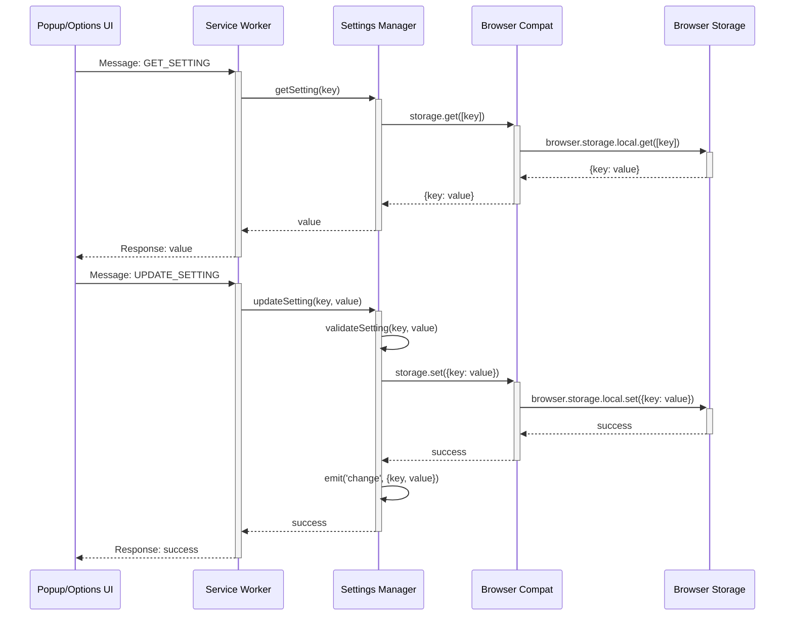
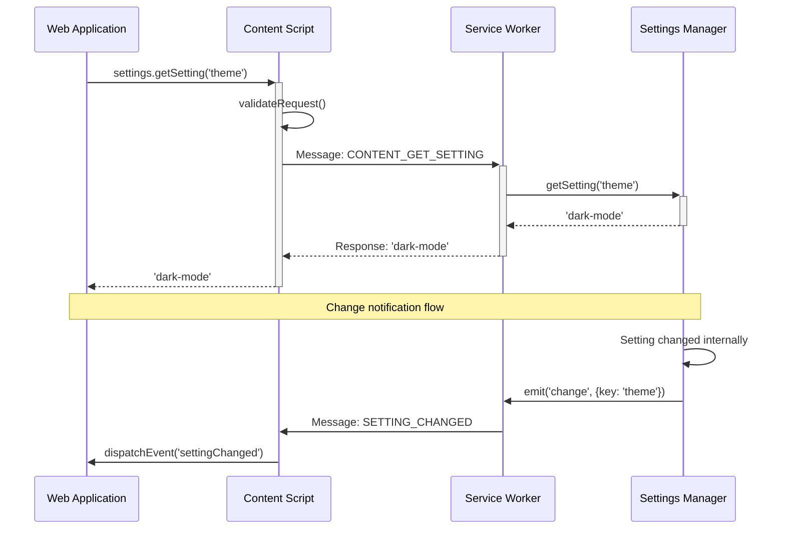
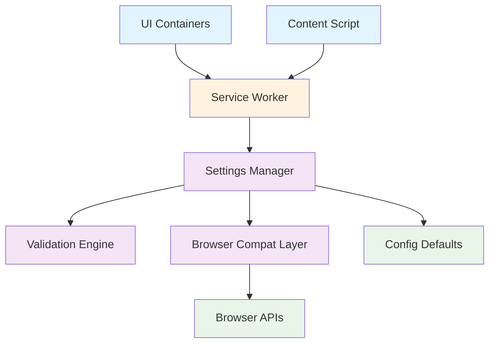
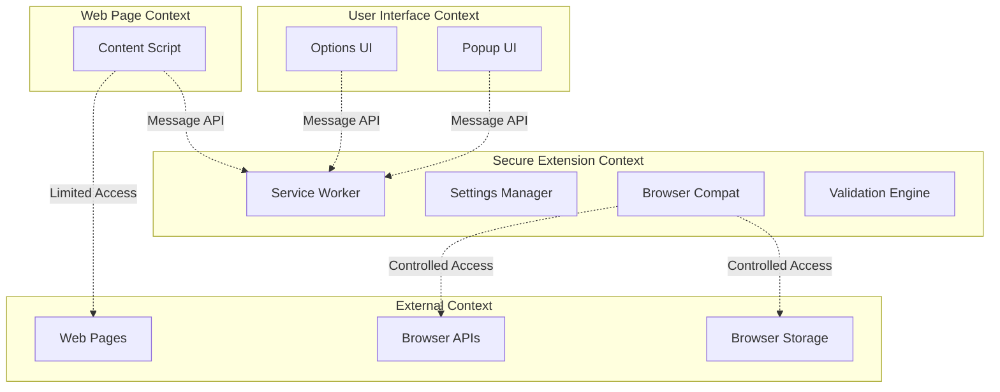

# Container Overview Diagram

## Executive Summary

This diagram shows the major containers (high-level components) within the Settings Extension system and how they interact with each other and external systems. This is a C4 Model Level 2 diagram that breaks down the Settings Extension system into its primary architectural containers.

## Scope

- **Applies to**: Container-level architecture and inter-container relationships
- **Last Updated**: 2025-08-11
- **Status**: Approved

## Container Architecture Overview

```mermaid
C4Container
    title Container Diagram - Settings Extension

    Person(user, "Extension User", "Manages settings through extension interface")
    Person(webdev, "Web Developer", "Integrates extension settings into web applications")

    System_Boundary(extension, "Settings Extension") {
        Container(service_worker, "Service Worker", "JavaScript", "Background service worker handling extension lifecycle, message routing, and storage coordination")

        Container(popup_ui, "Popup UI", "HTML/CSS/JavaScript", "Browser action popup providing quick access to common settings and actions")

        Container(options_ui, "Options UI", "HTML/CSS/JavaScript", "Full-featured options page with advanced settings, import/export, and management tools")

        Container(content_script, "Content Script", "JavaScript", "Content script providing programmatic settings API to web pages")

        Container(settings_manager, "Settings Manager", "JavaScript Library", "Core business logic for settings CRUD operations, validation, and event management")

        Container(browser_compat, "Browser Compatibility Layer", "JavaScript Library", "Custom cross-browser compatibility abstraction replacing WebExtension Polyfill")

        Container(validation_engine, "Validation Engine", "JavaScript Library", "Type checking, schema validation, and data sanitization for all settings operations")

        ContainerDb(config_defaults, "Default Configuration", "JSON", "Static configuration defining default settings, types, and validation rules")
    }

    System_Ext(chrome_apis, "Chrome APIs", "Browser Extension APIs for Chromium-based browsers")
    System_Ext(firefox_apis, "Firefox APIs", "WebExtension APIs for Firefox browser")
    System_Ext(browser_storage, "Browser Storage", "Local and sync storage provided by browser")
    System_Ext(web_pages, "Web Applications", "Third-party websites integrating with extension")

    %% User interactions
    Rel(user, popup_ui, "Quick settings access", "HTML")
    Rel(user, options_ui, "Advanced configuration", "HTML")

    %% Web developer interactions
    Rel(webdev, content_script, "Settings API calls", "JavaScript")
    Rel(content_script, web_pages, "Injects API into", "JavaScript")

    %% Internal container relationships
    Rel(popup_ui, service_worker, "Settings requests", "Message API")
    Rel(options_ui, service_worker, "Settings operations", "Message API")
    Rel(content_script, service_worker, "Settings API calls", "Message API")

    Rel(service_worker, settings_manager, "Business logic calls", "JavaScript")
    Rel(settings_manager, validation_engine, "Data validation", "JavaScript")
    Rel(settings_manager, browser_compat, "Storage operations", "JavaScript")
    Rel(settings_manager, config_defaults, "Loads defaults", "JSON")

    %% External system integration
    Rel(browser_compat, chrome_apis, "Chrome API calls", "Extension API")
    Rel(browser_compat, firefox_apis, "Firefox API calls", "WebExtension API")
    Rel(browser_compat, browser_storage, "Data persistence", "Storage API")

    UpdateRelStyle(user, popup_ui, $textColor="blue", $lineColor="blue")
    UpdateRelStyle(user, options_ui, $textColor="blue", $lineColor="blue")
    UpdateRelStyle(webdev, content_script, $textColor="green", $lineColor="green")
```

## Container Descriptions

### User Interface Containers

#### Popup UI Container

- **Technology**: HTML5, CSS3, Vanilla JavaScript
- **Purpose**: Provides quick access to common settings through browser toolbar
- **Key Responsibilities**:
  - Render simple settings forms (boolean, text, number types)
  - Handle form validation and user feedback
  - Communicate with Service Worker for settings operations
  - Provide shortcuts to advanced options page
- **File Location**: `/popup/` directory
- **Size**: ~300 lines of code
- **Performance Target**: < 500ms load time

#### Options UI Container

- **Technology**: HTML5, CSS3, Vanilla JavaScript
- **Purpose**: Full-featured settings management interface
- **Key Responsibilities**:
  - Display hierarchical settings with search and filtering
  - Handle complex settings types (JSON, longtext)
  - Manage import/export operations
  - Provide settings validation feedback and error handling
  - Support bulk operations and advanced configuration
- **File Location**: `/options/` directory
- **Size**: ~600 lines of code
- **Performance Target**: < 500ms load time, < 100ms search response

### Integration Containers

#### Content Script Container

- **Technology**: Vanilla JavaScript (ES6+ modules)
- **Purpose**: Provides programmatic settings API to web applications
- **Key Responsibilities**:
  - Expose ContentScriptSettings API to web page context
  - Handle API authentication and permission validation
  - Proxy settings requests to Service Worker
  - Manage change event listeners and notification distribution
  - Provide graceful degradation when extension unavailable
- **File Location**: `/content-script.js` and `/lib/content-settings.js`
- **Size**: ~400 lines of code
- **Performance Target**: < 50ms API response time

#### Service Worker Container

- **Technology**: Vanilla JavaScript (Service Worker APIs)
- **Purpose**: Central coordination and message handling hub
- **Key Responsibilities**:
  - Route messages between UI components and Content Scripts
  - Coordinate extension lifecycle (install, activate, update)
  - Manage extension-level error handling and recovery
  - Handle background operations and maintenance tasks
  - Serve as single point of truth for extension state
- **File Location**: `/background.js`
- **Size**: ~400 lines of code
- **Performance Target**: < 100ms message handling latency

### Core Business Logic Containers

#### Settings Manager Container

- **Technology**: Vanilla JavaScript (ES6+ classes)
- **Purpose**: Core business logic for all settings operations
- **Key Responsibilities**:
  - Implement CRUD operations for settings data
  - Manage settings schema loading and validation coordination
  - Handle settings import/export with data transformation
  - Provide event system for settings change notifications
  - Coordinate with storage layer through Browser Compatibility Layer
- **File Location**: `/lib/settings-manager.js`
- **Size**: ~500 lines of code
- **Performance Target**: < 100ms for standard operations

#### Browser Compatibility Layer Container

- **Technology**: Vanilla JavaScript (Feature Detection)
- **Purpose**: Custom cross-browser compatibility abstraction
- **Key Responsibilities**:
  - Detect browser capabilities and available APIs
  - Provide unified interface for Chrome and Firefox APIs
  - Handle promise conversion for Chrome callback APIs
  - Manage storage quota checking and error recovery
  - Abstract browser-specific differences in messaging
- **File Location**: `/lib/browser-compat.js`
- **Size**: ~150 lines of code
- **Performance Target**: < 10ms API abstraction overhead

#### Validation Engine Container

- **Technology**: Vanilla JavaScript (Validation Logic)
- **Purpose**: Comprehensive data validation and type safety
- **Key Responsibilities**:
  - Validate setting values against defined schemas
  - Perform type checking and conversion
  - Sanitize input data for security
  - Generate detailed validation error messages
  - Support custom validation rules and constraints
- **File Location**: `/lib/validation.js`
- **Size**: ~250 lines of code
- **Performance Target**: < 5ms validation time per setting

### Configuration Container

#### Default Configuration Container

- **Technology**: Static JSON configuration files
- **Purpose**: Define default settings, schemas, and validation rules
- **Key Responsibilities**:
  - Provide default values for all supported settings
  - Define setting types, constraints, and validation rules
  - Support schema versioning and migration definitions
  - Enable configuration customization for different deployment contexts
- **File Location**: `/config/defaults.json`
- **Size**: ~100 lines of JSON
- **Update Frequency**: Changed with feature releases

## Container Integration Patterns

### Message Passing Architecture

### Content Script Integration

## Container Dependencies

### Dependency Hierarchy

### Layer Separation

| Layer                    | Containers                                  | Responsibilities                                                 |
| ------------------------ | ------------------------------------------- | ---------------------------------------------------------------- |
| **Presentation Layer**   | Popup UI, Options UI                        | User interaction, form handling, display logic                   |
| **Integration Layer**    | Content Script, Service Worker              | External communication, message routing, lifecycle management    |
| **Business Logic Layer** | Settings Manager, Validation Engine         | Core functionality, business rules, data processing              |
| **Infrastructure Layer** | Browser Compat Layer, Default Configuration | Platform abstraction, configuration, external system integration |

## Container Quality Attributes

### Performance Characteristics

| Container             | Load Time | Response Time | Memory Usage | CPU Usage |
| --------------------- | --------- | ------------- | ------------ | --------- |
| **Popup UI**          | < 500ms   | < 100ms       | < 2MB        | Low       |
| **Options UI**        | < 500ms   | < 200ms       | < 5MB        | Medium    |
| **Content Script**    | < 100ms   | < 50ms        | < 1MB        | Low       |
| **Service Worker**    | < 200ms   | < 100ms       | < 3MB        | Medium    |
| **Settings Manager**  | N/A       | < 100ms       | < 2MB        | Medium    |
| **Browser Compat**    | N/A       | < 10ms        | < 0.5MB      | Low       |
| **Validation Engine** | N/A       | < 5ms         | < 0.5MB      | Low       |

### Reliability Requirements

- **Service Worker**: 99.9% availability during browser session
- **UI Containers**: Graceful degradation when service worker unavailable
- **Content Script**: Fail-safe operation when extension disabled
- **Storage Layer**: Automatic recovery from storage errors
- **Validation**: 100% input validation coverage

### Security Boundaries

## Container Evolution Strategy

### Current Architecture Strengths

- **Clear Separation**: Well-defined container boundaries and responsibilities
- **Testability**: Each container can be unit tested independently
- **Modularity**: Containers can be modified without affecting others
- **Cross-browser**: Browser Compatibility Layer enables consistent behavior

### Planned Enhancements

- **Enhanced Validation**: More sophisticated validation rules and custom validators
- **Improved Performance**: Caching layer in Settings Manager
- **Extended APIs**: Additional content script API capabilities
- **Better Error Handling**: Enhanced error recovery and user feedback

### Migration Considerations

- **Backwards Compatibility**: API contracts maintained across versions
- **Data Migration**: Settings schema evolution handled by Settings Manager
- **Browser Updates**: Browser Compatibility Layer adapts to API changes
- **Feature Flags**: Gradual rollout of new container functionality

## Testing Strategy by Container

### UI Container Testing

- **Unit Tests**: Component rendering, form validation, user interaction handling
- **Integration Tests**: Service Worker communication, error handling
- **Browser Tests**: Cross-browser UI compatibility, accessibility compliance
- **User Acceptance Tests**: End-to-end user workflow validation

### Service Layer Testing

- **Unit Tests**: Message routing, lifecycle management, error handling
- **Integration Tests**: Settings Manager interaction, storage operations
- **Performance Tests**: Message handling latency, concurrent operation handling
- **Reliability Tests**: Extension lifecycle scenarios, error recovery

### Business Logic Testing

- **Unit Tests**: Settings operations, validation logic, event handling
- **Integration Tests**: Storage layer interaction, configuration loading
- **Property Tests**: Settings validation with random input data
- **Performance Tests**: Large dataset handling, concurrent access patterns

## Related Documentation

- **[Building Blocks](../05-building-blocks.md)** - Detailed component view of these containers
- **[Runtime View](../06-runtime-view.md)** - How these containers interact during operation
- **[System Context](system-context.md)** - Higher-level system boundary view
- **[Component Interactions](component-interactions.md)** - Detailed component relationships within containers
- **[Extension Development Guide](../../developer/guides/extension-development.md)** - Implementation guidance for these containers

## References

- [C4 Model Container Diagrams](https://c4model.com/#ContainerDiagram)
- [Chrome Extension Architecture](https://developer.chrome.com/docs/extensions/mv3/architecture-overview/)
- [Service Worker Architecture](https://developer.chrome.com/docs/extensions/mv3/service-workers/)
- [Browser Extension UI Patterns](https://developer.mozilla.org/en-US/docs/Mozilla/Add-ons/WebExtensions/user_interface)

## Revision History

| Date       | Author            | Changes                                                   |
| ---------- | ----------------- | --------------------------------------------------------- |
| 2025-08-11 | Architecture Team | Initial container diagram and comprehensive documentation |
