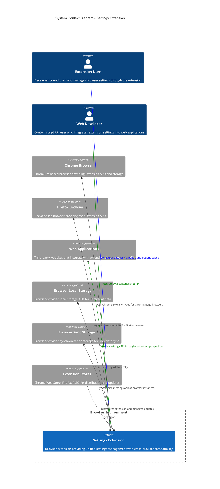
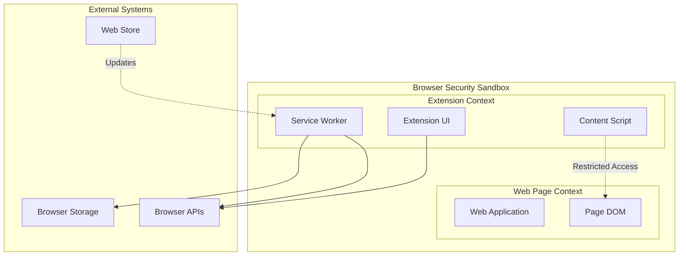
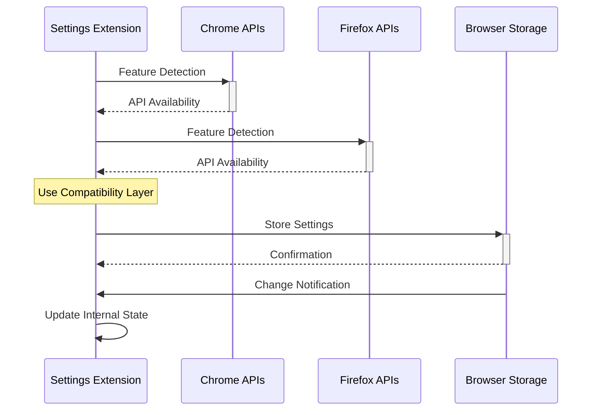
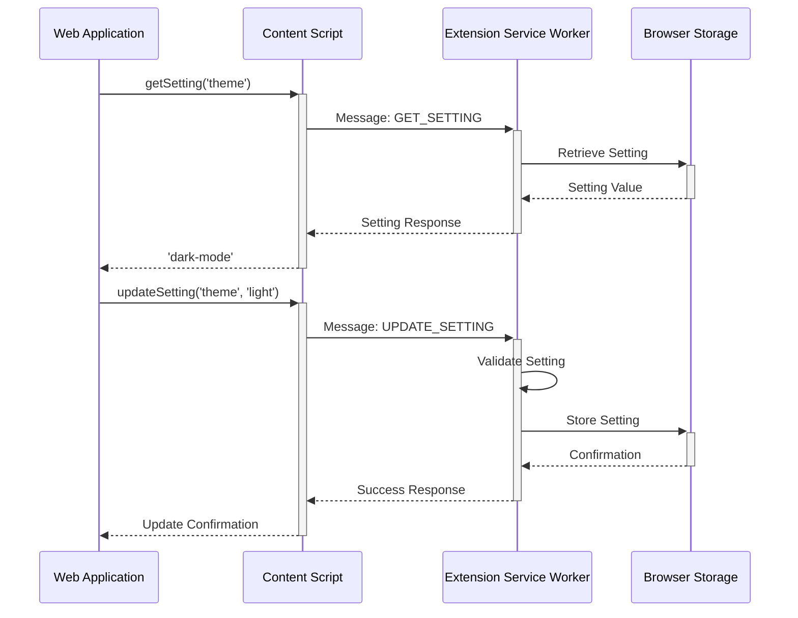
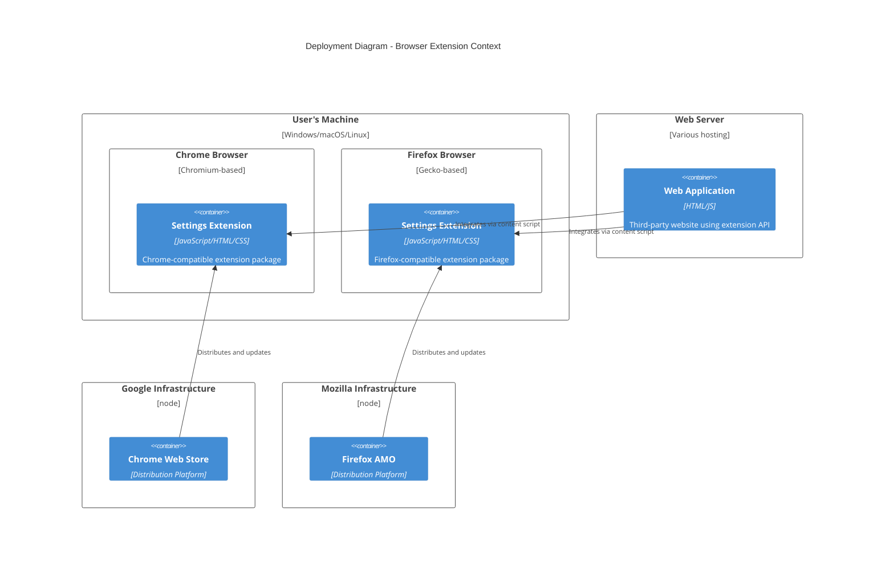

# System Context Diagram

## Executive Summary

This diagram shows the Settings Extension in its broader ecosystem context, illustrating how it interacts with browser environments, web pages, and external systems. This is a C4 Model Level 1 diagram providing the highest level view of system boundaries and relationships.

## Scope

- **Applies to**: System boundary definition and external interactions
- **Last Updated**: 2025-08-11
- **Status**: Approved

## System Context Overview

## Context Description

### Primary Actors

#### Extension User
- **Role**: End-users and developers who configure browser settings
- **Interactions**: 
  - Access extension through browser toolbar popup
  - Configure advanced settings through options page
  - Import/export settings for backup and sharing
  - Receive feedback through extension UI notifications
- **Goals**: Efficiently manage browser and web application settings

#### Web Developer  
- **Role**: Developers integrating extension settings into their web applications
- **Interactions**:
  - Access settings through content script API
  - Register change listeners for setting updates
  - Update settings programmatically from web page context
  - Handle validation errors and permission requests
- **Goals**: Seamlessly integrate extension settings into application workflows

### Target Systems

#### Settings Extension (Core System)
- **Responsibility**: Unified settings management across browsers
- **Key Capabilities**:
  - Cross-browser compatibility layer
  - Settings validation and type safety
  - Import/export functionality
  - Real-time settings synchronization
  - Content script API for web integration
- **Boundaries**: Operates within browser security sandbox

### External Systems

#### Browser Environments

**Chrome Browser (Chromium-based)**
- **Provides**: Chrome Extension APIs, storage mechanisms, UI integration points
- **Version Support**: Chrome 88+, Edge 88+ (Manifest V3 compatible)
- **Key APIs**: chrome.storage, chrome.runtime, chrome.tabs, chrome.action
- **Integration Pattern**: Direct API calls with callback-to-promise conversion

**Firefox Browser (Gecko-based)**  
- **Provides**: WebExtension APIs, storage mechanisms, UI integration points
- **Version Support**: Firefox 78+ (WebExtension compatible)
- **Key APIs**: browser.storage, browser.runtime, browser.tabs, browser.action  
- **Integration Pattern**: Native promise-based API calls

#### Storage Systems

**Browser Local Storage**
- **Purpose**: Persistent local settings storage
- **Capacity**: Up to 10MB per extension (browser-dependent)
- **Scope**: Local to browser installation
- **Access Pattern**: Key-value storage with JSON serialization

**Browser Sync Storage**  
- **Purpose**: Cross-device settings synchronization
- **Capacity**: Limited quota (100KB Chrome, 1MB Firefox)  
- **Scope**: Synchronized across user's browser instances
- **Access Pattern**: Automatic sync when available, fallback to local

#### Web Applications
- **Role**: Third-party websites integrating extension settings
- **Integration**: Content script injection provides settings API
- **Security**: Same-origin policy and CSP compliance required
- **Communication**: Message passing through browser extension APIs

#### Extension Distribution
- **Chrome Web Store**: Primary distribution for Chromium browsers
- **Firefox AMO**: Primary distribution for Firefox browser  
- **Enterprise Distribution**: Direct installation for enterprise users
- **Update Mechanism**: Automatic updates through browser extension management

## System Boundaries

### Security Boundaries

### Data Flow Boundaries

**Inbound Data Flows:**
- User configuration through extension UI
- Settings requests from web applications via content script
- Browser storage change notifications
- Extension update notifications from stores

**Outbound Data Flows:**
- Settings data persistence to browser storage
- Settings API responses to web applications
- Validation errors and status updates to UI
- Analytics and error reporting (if configured)

## Quality Attributes Context

### Performance Requirements
- **Settings Operations**: < 100ms response time
- **UI Load Time**: < 500ms for popup and options pages
- **Memory Usage**: < 10MB per browser tab
- **Storage Access**: < 50ms for cached settings

### Reliability Requirements  
- **Availability**: 99.9% uptime during browser session
- **Error Recovery**: Graceful degradation when storage unavailable
- **Data Integrity**: Settings validation prevents corruption
- **Cross-browser**: Consistent behavior across supported browsers

### Security Requirements
- **Sandboxing**: Operates within browser security constraints
- **Permissions**: Minimal required permissions (storage, activeTab)
- **Content Security Policy**: Compliance with CSP restrictions
- **Data Privacy**: No external data transmission without consent

### Usability Requirements
- **Accessibility**: WCAG 2.1 AA compliance for extension UI
- **Internationalization**: Support for multiple languages and locales
- **Progressive Enhancement**: Core functionality works without advanced features
- **Error Messages**: Clear, actionable error messages for users

## Integration Patterns

### Browser API Integration

### Web Application Integration

## Deployment Context

### Browser Extension Architecture

## Evolution and Scalability

### Current Limitations
- **Browser Support**: Limited to Chrome/Firefox with Manifest V3
- **Storage Capacity**: Constrained by browser extension storage limits
- **API Surface**: Content script API provides read-only web page access
- **Synchronization**: Dependent on browser-provided sync capabilities

### Future Extension Points
- **Additional Browsers**: Safari, Edge Legacy support
- **Enhanced APIs**: Broader web application integration capabilities  
- **External Storage**: Cloud storage integration for larger datasets
- **Enterprise Features**: Centralized management and policy enforcement

### Scalability Considerations
- **User Base**: Architecture supports thousands of concurrent users per browser
- **Data Volume**: Designed for typical settings datasets (< 1MB per user)
- **API Throughput**: Optimized for typical web application integration patterns
- **Update Distribution**: Relies on browser extension update mechanisms

## Related Documentation

- **[System Goals](../01-introduction-goals.md)** - Requirements that shape this system context
- **[Building Blocks](../05-building-blocks.md)** - Internal structure of the Settings Extension system
- **[Runtime View](../06-runtime-view.md)** - Dynamic behavior within this context
- **[Container Overview](container-overview.md)** - Next level of architectural detail
- **[Browser Extension Development](../../developer/guides/extension-development.md)** - Implementation guidance for this context

## Revision History

| Date | Author | Changes |
|------|--------|---------|
| 2025-08-11 | Architecture Team | Initial system context diagram and documentation |