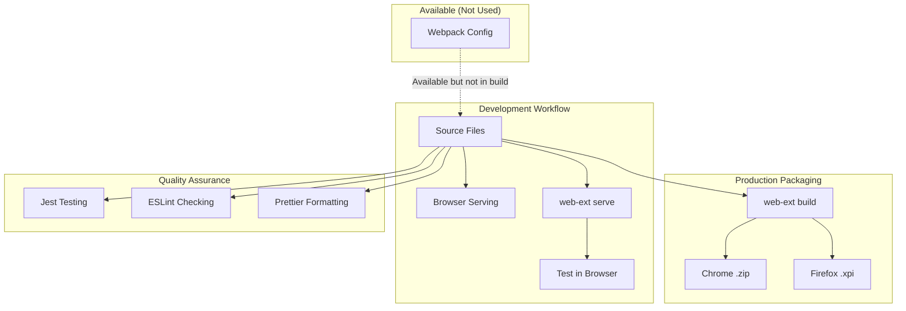

# Build System Guide

## Executive Summary

The Settings Extension uses a direct file serving approach for development and web-ext for packaging, with Webpack available in dependencies but not used in the build process. This document explains the build system architecture, development workflow, and deployment strategy.

## Scope

- **Applies to**: Build configuration, development workflow, and packaging processes
- **Last Updated**: 2025-08-11
- **Status**: Approved

## Build System Architecture

### Philosophy: Simplicity Over Complexity

The Settings Extension deliberately uses a minimal build system based on the principle of serving source files directly. This approach provides several benefits:

- **Debugging Clarity**: No build artifacts means step-through debugging works seamlessly
- **Development Speed**: No build step required for testing changes
- **Browser Compatibility**: Direct file serving matches browser extension execution model
- **Maintenance Simplicity**: Fewer build tools to configure, update, and troubleshoot

### Current Build Architecture



## Development Workflow

### Local Development Process

#### 1. Direct File Development

```bash
# No build step required - edit files directly
code popup/popup.js
code options/options.js
code lib/settings-manager.js
```

#### 2. Browser Testing

```bash
# Serve extension for Chrome testing
npm run serve

# Or serve for Firefox testing
npm run serve:firefox

# Or use web-ext directly
web-ext run --browser-console
```

#### 3. Watch Mode Development

```bash
# Run development server with auto-reload
npm run dev

# This runs: concurrently "npm run serve" "npm run watch"
# - serve: Starts web-ext serve for browser testing
# - watch: Monitors files for changes (future webpack integration)
```

### File Structure for Development

```
settings-extension/
├── background.js          # Direct source - no transpilation
├── content-script.js      # Direct source - no transpilation
├── popup/
│   ├── popup.html        # Direct serving
│   ├── popup.css         # Direct serving
│   └── popup.js          # Direct source - no transpilation
├── options/
│   ├── options.html      # Direct serving
│   ├── options.css       # Direct serving
│   └── options.js        # Direct source - no transpilation
├── lib/                  # All files served directly
│   ├── browser-compat.js # Custom compatibility layer
│   ├── settings-manager.js
│   ├── content-settings.js
│   └── validation.js
├── config/
│   └── defaults.json     # Static configuration
└── manifest.json         # Extension manifest
```

### Development Server Configuration

The development environment uses `web-ext` for browser integration:

```json
// package.json scripts
{
  "dev": "concurrently \"npm run serve\" \"npm run watch\"",
  "serve": "web-ext run --browser-console --reload",
  "serve:firefox": "web-ext run --target firefox-desktop --browser-console",
  "watch": "echo 'File watching ready for webpack integration'"
}
```

## Production Packaging

### Packaging Process

#### Chrome/Edge Packaging

```bash
# Package for Chrome Web Store
npm run package:chrome

# This runs: web-ext build --artifacts-dir web-ext-artifacts --filename settings-extension-chrome.zip
```

#### Firefox Packaging

```bash
# Package for Firefox AMO
npm run package:firefox

# This runs: web-ext build --artifacts-dir web-ext-artifacts --filename settings-extension-firefox.xpi
```

#### Universal Packaging

```bash
# Package for all browsers
npm run package

# This runs: web-ext build --artifacts-dir web-ext-artifacts
```

### Packaging Configuration

The packaging uses `web-ext` with configuration:

```json
// package.json web-ext configuration
"webExt": {
  "build": {
    "ignoreFiles": [
      "docs/**",
      "test/**",
      "coverage/**",
      "node_modules/**",
      "*.md",
      ".*"
    ]
  }
}
```

### Output Artifacts

Packaging creates these files:

```
web-ext-artifacts/
├── settings-extension-chrome.zip    # Chrome Web Store format
├── settings-extension-firefox.xpi   # Firefox AMO format
└── settings_extension-1.0.0.zip     # Generic format
```

## Webpack Integration (Available but Not Used)

### Why Webpack is Present but Not Used

The project includes Webpack in dependencies for future extensibility, but the current build process doesn't use it because:

1. **Direct Serving Benefits**: Source files work directly in browsers without transpilation
2. **Debugging Clarity**: No source maps needed when serving original files
3. **Development Speed**: No build step means faster iteration cycles
4. **Extension Compatibility**: Browser extensions load files directly, matching our approach

### Webpack Configuration (Future Use)

A `webpack.config.js` exists for potential future use:

```javascript
// webpack.config.js (available for future integration)
const path = require("path");

module.exports = {
  entry: {
    background: "./background.js",
    "content-script": "./content-script.js",
    popup: "./popup/popup.js",
    options: "./options/options.js",
  },
  output: {
    path: path.resolve(__dirname, "dist"),
    filename: "[name].js",
  },
  mode: process.env.NODE_ENV === "production" ? "production" : "development",
  devtool: "source-map",
};
```

### When Webpack Might Be Activated

Future scenarios where Webpack could be beneficial:

- **Advanced TypeScript Integration**: If migrating from vanilla JavaScript
- **Code Splitting**: For larger codebase with dynamic imports
- **Asset Processing**: If adding complex CSS preprocessing or image optimization
- **Bundle Optimization**: For size-sensitive deployment scenarios

## Quality Assurance Integration

### Code Quality Tools

The build system integrates with quality assurance tools:

```bash
# Code formatting with Prettier
npm run format
npm run format:check

# Code linting with ESLint
npm run lint
npm run lint:fix

# Pre-commit hooks
npm run precommit  # Runs lint-staged
```

### Testing Integration

Testing runs independently of the build system:

```bash
# Run all tests
npm test

# Watch mode testing
npm run test:watch

# Coverage reporting
npm run test:coverage

# Cross-browser testing
npm run test:chrome
npm run test:firefox
npm run test:all
```

### Continuous Integration

The build system supports CI/CD pipelines:

```yaml
# Example GitHub Actions workflow
name: Build and Test
on: [push, pull_request]

jobs:
  test:
    runs-on: ubuntu-latest
    steps:
      - uses: actions/checkout@v3
      - uses: actions/setup-node@v3
        with:
          node-version: "18"
      - run: npm ci
      - run: npm run lint
      - run: npm test
      - run: npm run package
```

## Performance Characteristics

### Development Performance

| Operation                      | Time  | Notes                                |
| ------------------------------ | ----- | ------------------------------------ |
| **File Edit → Browser Reload** | < 1s  | No build step required               |
| **Extension Reload**           | < 2s  | web-ext handles reload automatically |
| **Test Execution**             | < 10s | Jest runs directly on source files   |
| **Lint Check**                 | < 5s  | ESLint processes source files        |

### Build Performance

| Operation           | Time  | Output Size  |
| ------------------- | ----- | ------------ |
| **Chrome Package**  | < 10s | ~50KB        |
| **Firefox Package** | < 10s | ~50KB        |
| **Full Package**    | < 15s | ~100KB total |
| **Validation**      | < 5s  | web-ext lint |

## Deployment Strategy

### Development Deployment

```bash
# Load unpacked extension in Chrome
# 1. Open chrome://extensions/
# 2. Enable "Developer mode"
# 3. Click "Load unpacked"
# 4. Select project root directory

# Or use automated loading
npm run serve  # Automatically loads in browser
```

### Production Deployment

```bash
# 1. Package for target browsers
npm run package

# 2. Upload to extension stores
# Chrome Web Store: Upload settings-extension-chrome.zip
# Firefox AMO: Upload settings-extension-firefox.xpi

# 3. Automated deployment (future)
# npm run deploy:chrome
# npm run deploy:firefox
```

## Build System Maintenance

### Dependency Management

Key build dependencies:

```json
{
  "devDependencies": {
    "web-ext": "^7.8.0", // Core packaging and serving
    "concurrently": "^8.2.0", // Parallel script execution
    "webpack": "^5.88.0", // Available for future use
    "jest": "^29.6.0", // Testing framework
    "eslint": "^8.45.0", // Code linting
    "prettier": "^3.0.0" // Code formatting
  }
}
```

### Update Strategy

1. **Monthly**: Check for web-ext updates (critical for browser compatibility)
2. **Quarterly**: Review all build dependencies for security updates
3. **As Needed**: Update when browser extension APIs change
4. **Major Versions**: Evaluate Webpack integration when build complexity increases

### Troubleshooting Common Issues

#### Extension Won't Load

```bash
# Check manifest validation
web-ext lint

# Verify file permissions
ls -la manifest.json
```

#### Packaging Failures

```bash
# Clean artifacts and retry
rm -rf web-ext-artifacts
npm run package

# Check ignored files
web-ext build --verbose
```

#### Development Server Issues

```bash
# Kill existing processes
pkill -f web-ext

# Restart development server
npm run dev
```

## Comparison with Alternative Build Systems

### Current Approach vs Traditional Webpack Build

| Aspect                    | Direct Serving | Webpack Build        |
| ------------------------- | -------------- | -------------------- |
| **Development Speed**     | Instant        | 2-10s build time     |
| **Debugging**             | Direct source  | Source maps required |
| **Bundle Size**           | ~50KB          | ~30-40KB (minified)  |
| **Browser Compatibility** | Native         | May need polyfills   |
| **Maintenance**           | Low            | Medium-High          |
| **Team Learning Curve**   | None           | Moderate             |

### Current Approach vs Framework Solutions

| Aspect                 | Direct Serving | Plasmo/WXT            |
| ---------------------- | -------------- | --------------------- |
| **Setup Complexity**   | Minimal        | High                  |
| **Feature Richness**   | Basic          | Advanced              |
| **Vendor Lock-in**     | None           | Framework-dependent   |
| **Customization**      | Full control   | Framework limitations |
| **TypeScript Support** | Manual         | Built-in              |

## Future Evolution Path

### Phase 1: Current State (Implemented)

- Direct file serving for development
- web-ext for packaging and browser integration
- Basic quality assurance integration

### Phase 2: Enhanced Development (Planned)

- File watching with automatic browser reload
- Enhanced development server with proxy capabilities
- Improved error reporting and debugging tools

### Phase 3: Advanced Build Features (Future)

- Optional Webpack integration for complex scenarios
- TypeScript support with minimal build complexity
- Advanced asset optimization when needed

### Phase 4: Enterprise Features (Long-term)

- Automated deployment pipelines
- Multiple environment configurations
- Advanced packaging options for enterprise distribution

## Best Practices

### Development Best Practices

1. **Keep It Simple**: Don't add build complexity unless absolutely necessary
2. **Test Frequently**: Use `npm run serve` for immediate feedback
3. **Validate Early**: Run `web-ext lint` before committing changes
4. **Debug Directly**: Take advantage of direct source file debugging

### Packaging Best Practices

1. **Clean Builds**: Always start with clean artifact directory
2. **Test Packages**: Install and test packaged extensions before release
3. **Version Consistency**: Ensure manifest.json and package.json versions match
4. **Store Compliance**: Validate against store requirements before submission

### Maintenance Best Practices

1. **Regular Updates**: Keep web-ext updated for browser compatibility
2. **Dependency Audits**: Regularly audit and update build dependencies
3. **Performance Monitoring**: Track build and package times for regression detection
4. **Documentation**: Keep build documentation current with process changes

## Related Documentation

- **[Local Setup Guide](../workflows/local-setup.md)** - Environment setup for this build system
- **[Extension Development Guide](extension-development.md)** - Development practices using this build system
- **[Release Process](../workflows/release-process.md)** - Using build system for releases
- **[Architecture Decisions](../../architecture/09-architecture-decisions/)** - Architectural context for build choices

## References

- **[web-ext Documentation](https://extensionworkshop.com/documentation/develop/web-ext-command-reference/)** - Primary build tool documentation
- **[Chrome Extension Development](https://developer.chrome.com/docs/extensions/mv3/getstarted/)** - Browser extension development patterns
- **[Firefox Extension Development](https://developer.mozilla.org/docs/Mozilla/Add-ons/WebExtensions)** - Firefox extension development
- **[Webpack Documentation](https://webpack.js.org/)** - Future build tool reference

## Revision History

| Date       | Author           | Changes                            |
| ---------- | ---------------- | ---------------------------------- |
| 2025-08-11 | Development Team | Initial build system documentation |
